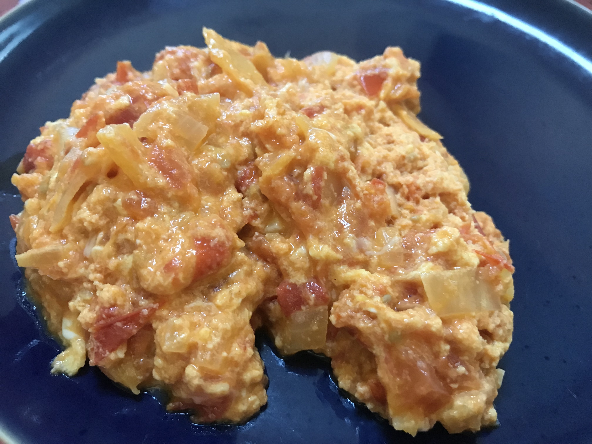

[prev](argentina.md)&emsp;
[top](../index.md)&emsp;
[next](australia.md)

# Armenia
18 July, 2021

Armenian breakfast: Tomatoes and eggs. Just what it sounds like. In
researching for this series, I found at least a dozen countries that
eat this dish.

[recipe video](https://youtu.be/652SKFwByfc)

