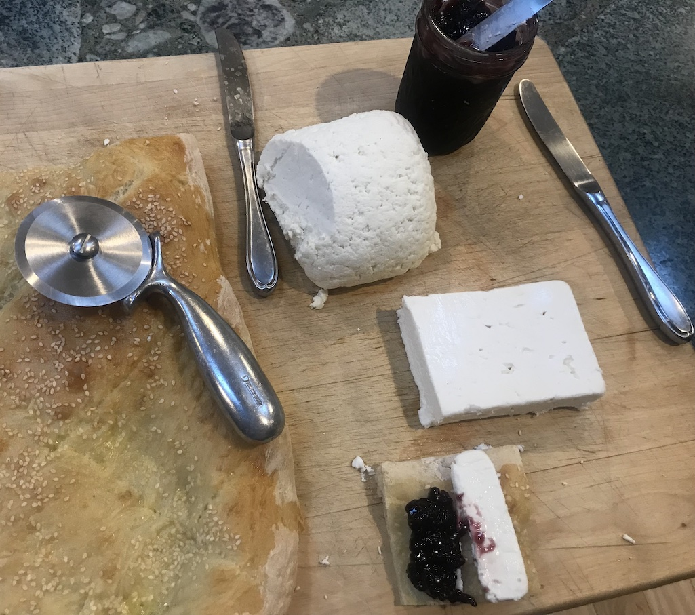

[prev](austria.md)&emsp;
[top](../index.md)&emsp;
[next](../b/bahamas.md)
# Azerbaijan
8 August, 2021

Azerbaijani breakfast: kesmik, feta, olallieberry jam, and tandir
bread. All homemade except the feta. The kesmik was easy to make, but
a little boring to eat.

[bread recipe](https://azcookbook.com/2008/01/15/tandoori-bread/) 
[cheese recipe](https://azcookbook.com/2011/02/17/curd-cheese/)

