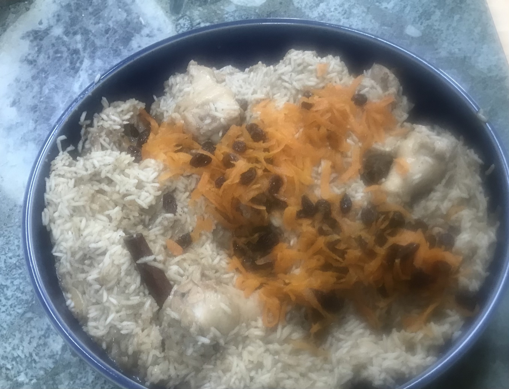

# Afghanistan

Afghani breakfast: pilaf with chicken parts and candied carrots and
raisins. We enjoyed this quite a bit, though I should have scaled the
recipe down.

[recipe](http://www.khanapakana.com/recipe/633faac9-b115-4d27-9e2a-60a2e231c748/afgahni-pilaf-afghani-pulao-")

