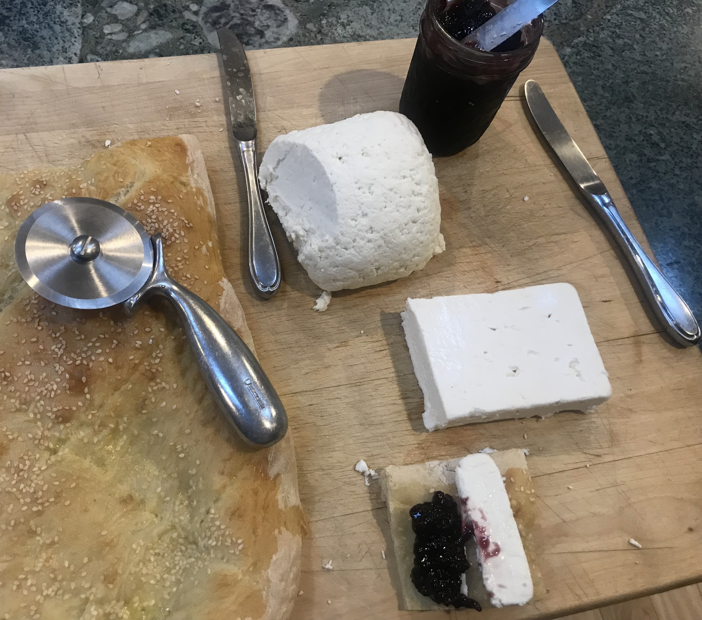

# Azerbaijan

Azerbaijani breakfast: kezmik, feta, olallieberry jam, and tandir
bread. All home made except the feta. The kezmic was easy to make, but
a little boring to eat.

<a href="https://azcookbook.com/2008/01/15/tandoori-bread/">
<a href="https://azcookbook.com/2011/02/17/curd-cheese/">

