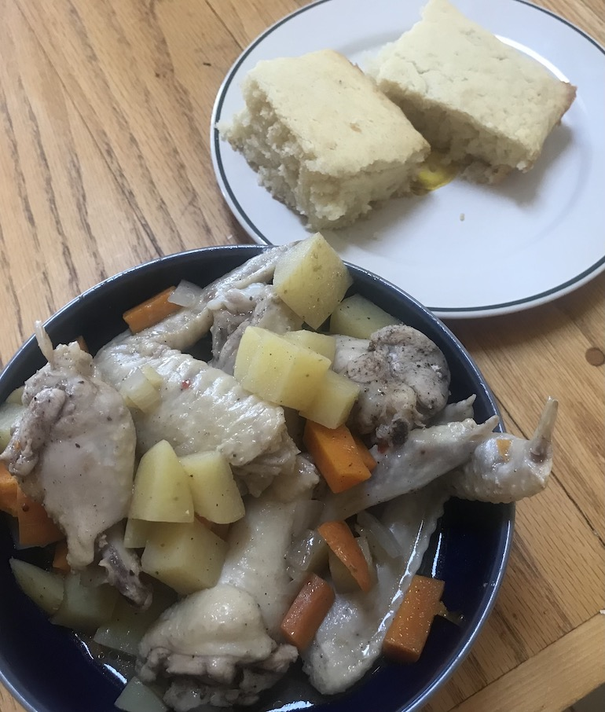

# The Bahamas

Bahamian breakfast: Chicken Souse and Johnny Cake. The lime in teh
souse was surprisingly strong, giving it a much lighter flaver than I
epxected. Very enjoyable.

[souse recipe](https://www.allrecipes.com/recipe/163906/bahamian-chicken-souse/)
 
[johnny cake recipe](https://www.hellocupcakeshoppe.com/post/bahamian-johnny-cake)

