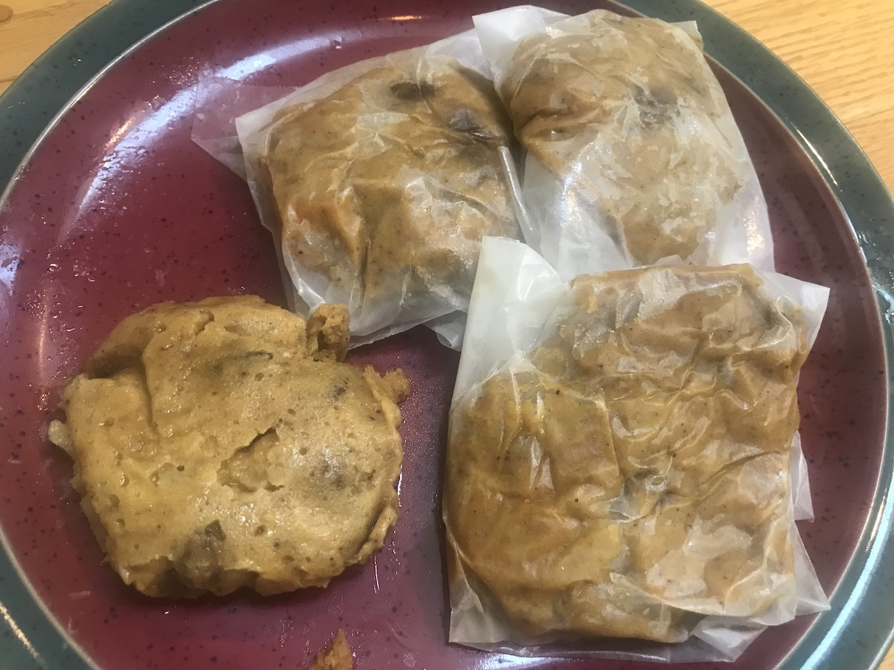

[prev](bangladesh.md)&emsp;
[top](../index.md)&emsp;
[next](belarus.md)
# Barbados
5 September, 2021

Barbados breakfast: Conkies. Sweet puddings cooked with steam. Very
similar to the ducana from Antigua.

They're supposed to be made with banana leaves, but I was unable to
source any.

[conkie recipe](https://barbados.org/barbados-recipes-conkies.htm#.YQNBOS9lBv)

