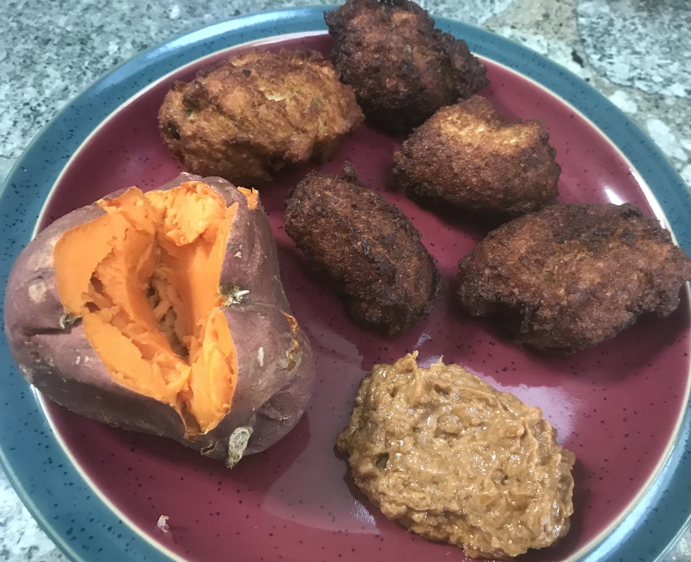

# Benin

Beninese breakfast: Akara, peanut sauce, baked yam. Akara are fritters
made from hulled black-eyed peas. Hulling black-eyed peas is a pain,
but the results were delicious.

[Akara recipe]
(https://rhubarbfool.co.uk/2011/09/26/breakfast-from-benin) 
[Peanut Sauce recipe](https://foreignfork.com/spicy-peanut-sauce)

