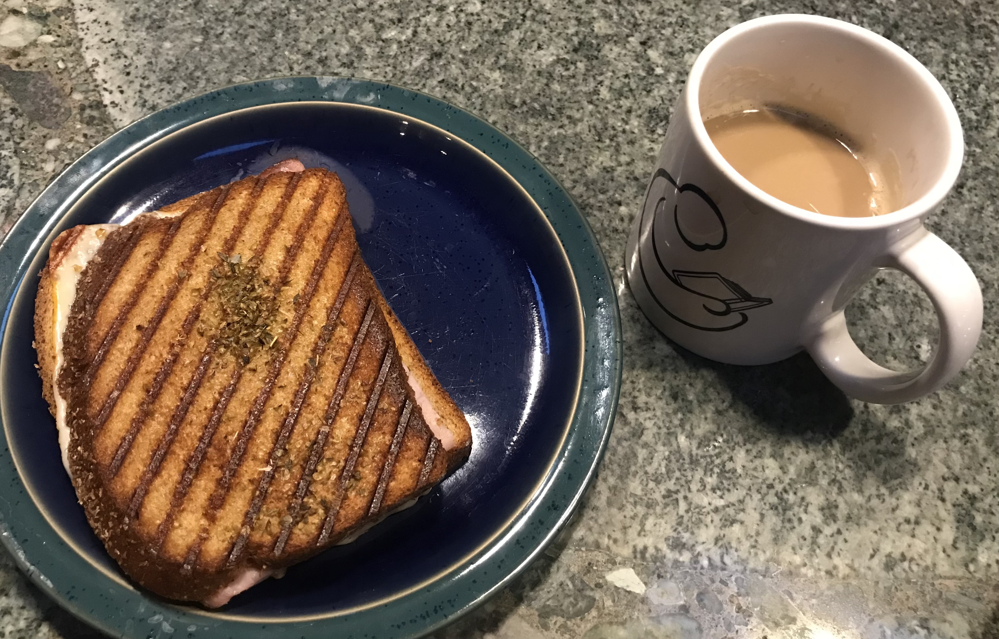

[prev](botswana.md)&emsp;
[top](../index.md)&emsp;
[next](brunei.md)
# Brazil
7 November, 2021

Brazilian breakfast: misto quento and pingado. Basically a breakfast
panini. Delicious. And of course, no Brazilian breakfast would be
complete without coffee. (I have no espresso machine, so compromises
were made.)

[sandwich recipe](https://ebarteldes.wordpress.com/2014/04/26/the-modern-sandwich-plus-classic-brazilian-misto-quente/)
 
[pingado recipe](https://foamycoffee.com/what-is-a-macchiato/)

