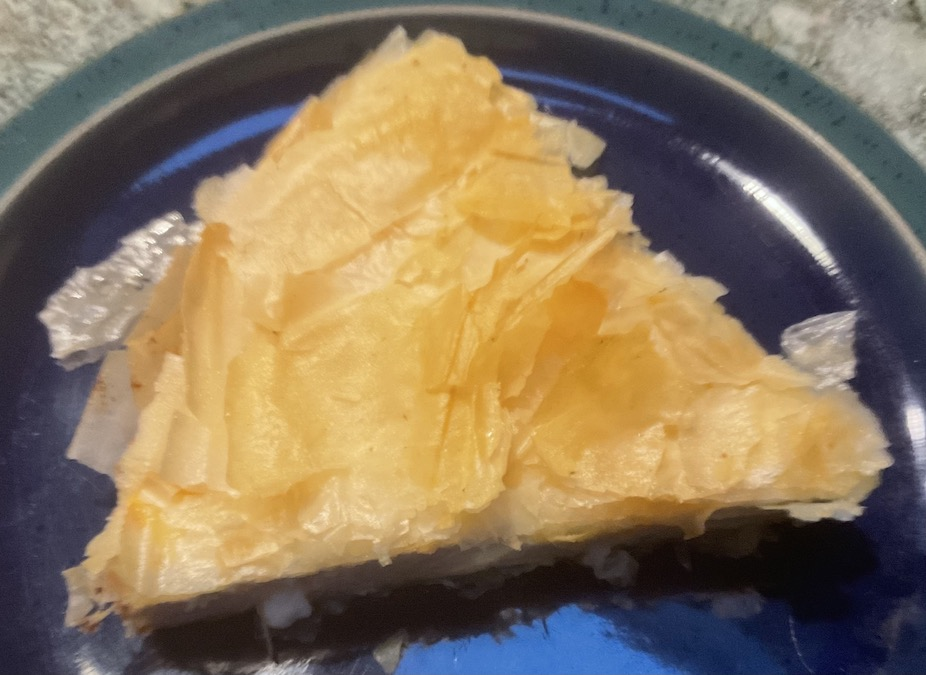

[prev](brunei.md)&emsp;
[top](../index.md)&emsp;
[next](burkina_faso.md)

# Bulgaria
21 November, 2021

Bulgarian breakfast: Banista. Feta cheese pie made with phyllo
dough. Very rich and filling, keeps you going all morning.

Used left-over phyllo from the freezer. Learn from my mistake: never
do this. Tasted great, but a complete pain to work with.

[banista recipe](https://cannedpeachesproject.com/banitsa-recipe-bulgarian-cheese-pie/)

