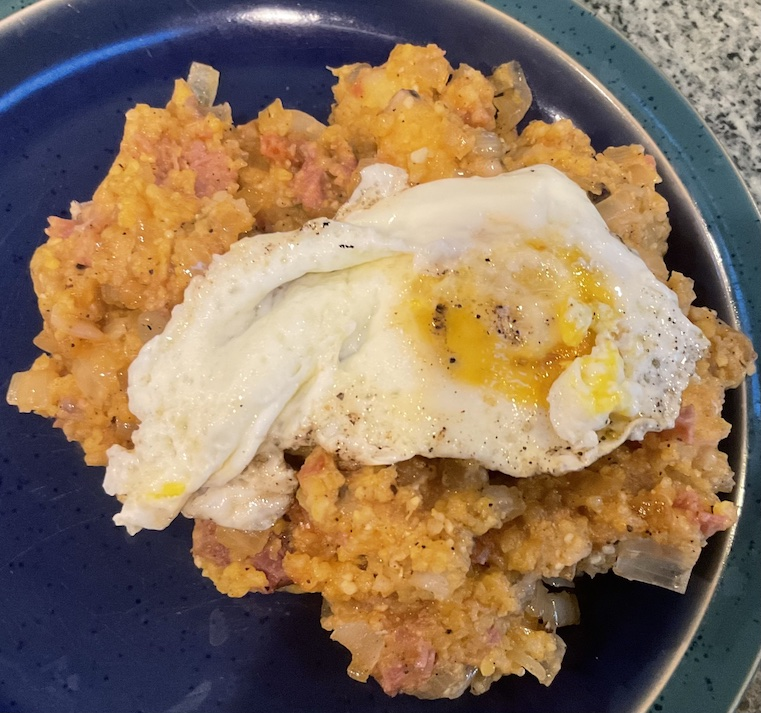

[prev](../b/burundi.md)
[top](../index.md)
[next](cambodia.md)
# Cabo Verde

Cabo Verdean breakfast: cachupa guisado. This dish is made from leftover cachupa, so I got to try two new things. Very hearty dish, and I think a small village could have been happy with the batch I made.

So. Much. Meat. &lt;erpp&gt;

[cachupa](https://www.food.com/recipe/cachupa-rica-344046) 
[cachupa guisado](https://www.crumbsnatched.com/cachupa-guisado-refogado-cape-verde/)

