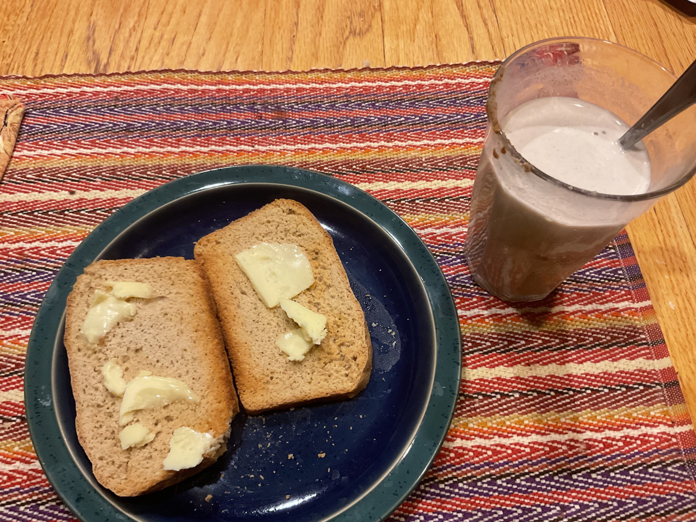

[prev](chad.md)
[top](../index.md)
[next](china.md)
# Chile
23 January, 2022

Chilean breakfast: ulpo and toast. I like this a lot mre than I
expected to; it improves a lot with added milk.

[Ulpo recipe](https://www.chileanfoodandgarden.com/ulpo-chilean-recipe/) 
The toast is a whole wheat loaf I made from James Beard's _Beard on Bread_.

