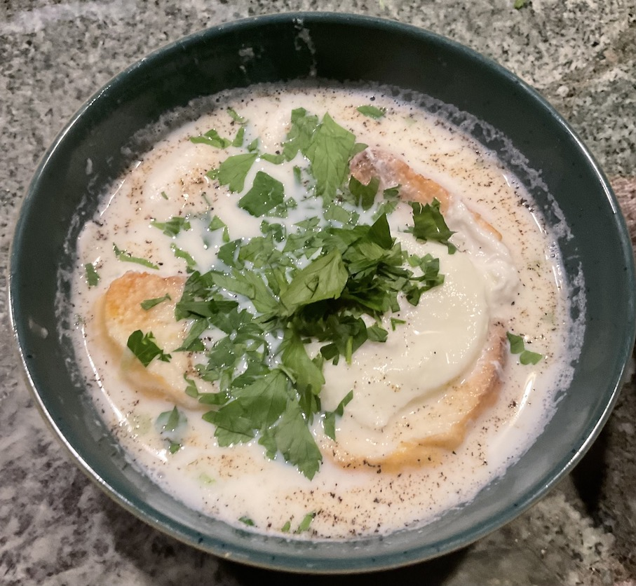

[prev](china.md)
[top](../index.md)
[next](comoros.md)
# Colombia

Colombian breakfast: changua. My first go at making poached eggs, and
it has to be paired with soggy bread. This dish would definitely take
som getting used to.

[recipe](https://www.unacolombianaencalifornia.com/2020/09/changua-colombian-breakfast-soup/)

