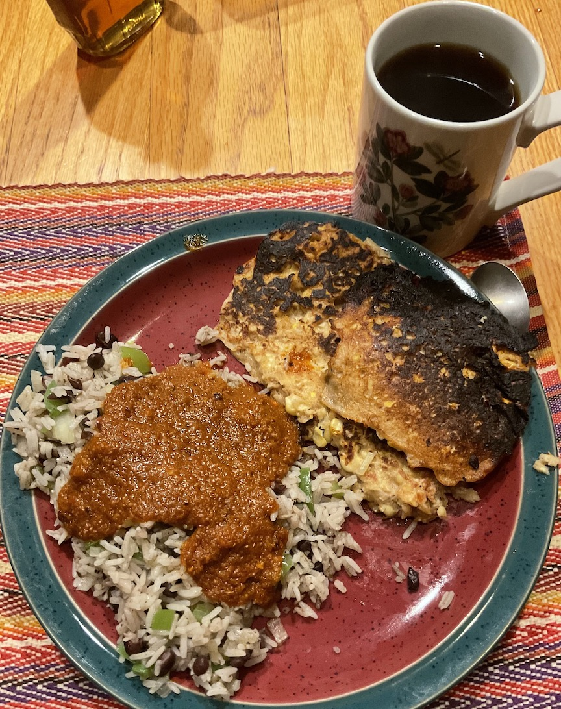

[prev](roc.md)&emsp;
[top](../index.md)&emsp;
[next](cote_divoire.md)
# Costa Rica
6 March, 2022

Costa Rican breakfast: (slightly burnt) choreadas, gallo pinto, lizano sauce, and coffee. Savory, just a bit spicy. Really good, though.

Clearly, my plating needs work....

[chorreadas recipe](https://www.recipesfromcostarica.com/recipes/chorreadas) 
[galla pinto recipe](https://www.allrecipes.com/recipe/284351/costa-rican-gallo-pinto/) 
[salsa recipe](https://www.thekitchn.com/recipe-lizano-style-costa-rican-salsa-176299_)

