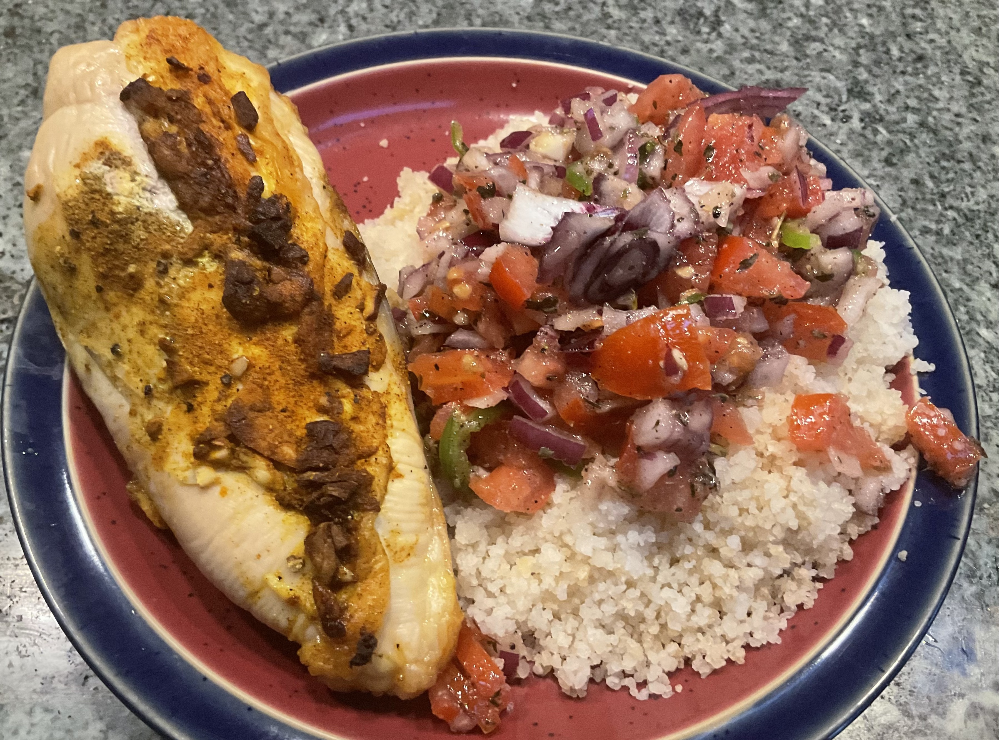

[prev](costa_rica.md)&emsp;
[top](../index.md)&emsp;
[next](croatia.md)
# Co&#770;te d'Ivoire
13 March, 2022

Ivoirian breakfast: Attie&#769;ke&#769; (aka Garba) with roast
chicken. It's more commonly served with fish, but this is also
common. Everything was great; we really enjoyed this one.

[attieke recipe](https://www.196flavors.com/ivory-coast-attieke/) 
[chicken recipe](https://www.deliciousmagazine.co.uk/recipes/whole-baked-chicken-with-north-african-spices/)

