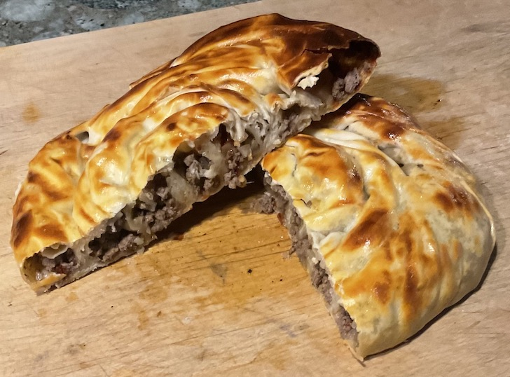

[prev](cote_divoire.md)&emsp;
[top](../index.md)&emsp;
[next](cuba.md)

# Croatia
20 March, 2022

Croatian breakfast: burek. Long tube of filo dough filled with spiced
meat, then coiled up. First time making filo dough. Fun and very
tasty. Very proud of this one.

[recipe](http://www.patesmith.co/rolani-burek-rolled-croatian-meat-pastry/)

