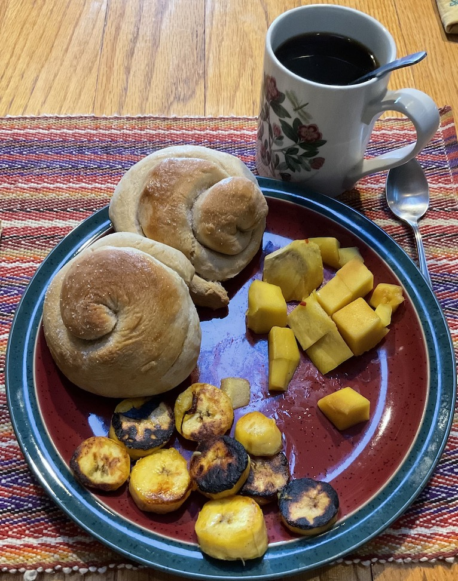

# Cuba

Cuban breakfast: Coffee, frut (plantain, mango), pan de
gloria. Amusingly, my wife's family are from Cuba, but they don't
remember this bread.

[recipe video](https://youtu.be/clwE4FybSlI)

