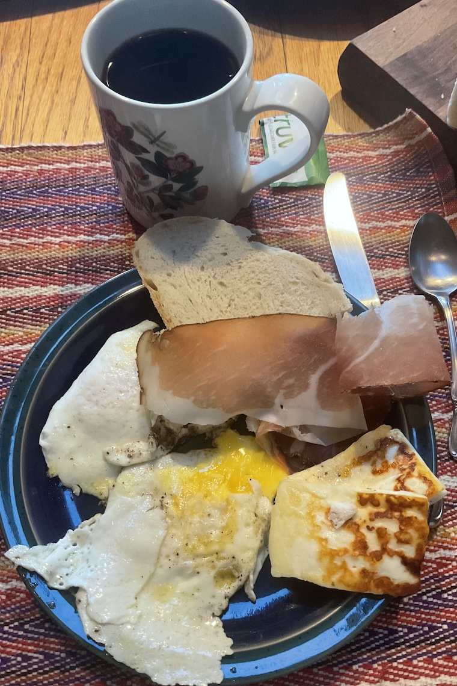

[prev](cuba.md)
[top](../index.md)
[next](czech.md)
# Cyprus

Cypriot breakfast: prozymi bread, fried eggs, fried halloumi, and
speck. The speck was a substitute for lountza, which I was unable to
source. The bread takes 10 days to make, because you have to make a
starter.

[bread recipe](https://www.kopiaste.org/2012/06/zymoto-psomi-cypriot-rustic-bread/)

