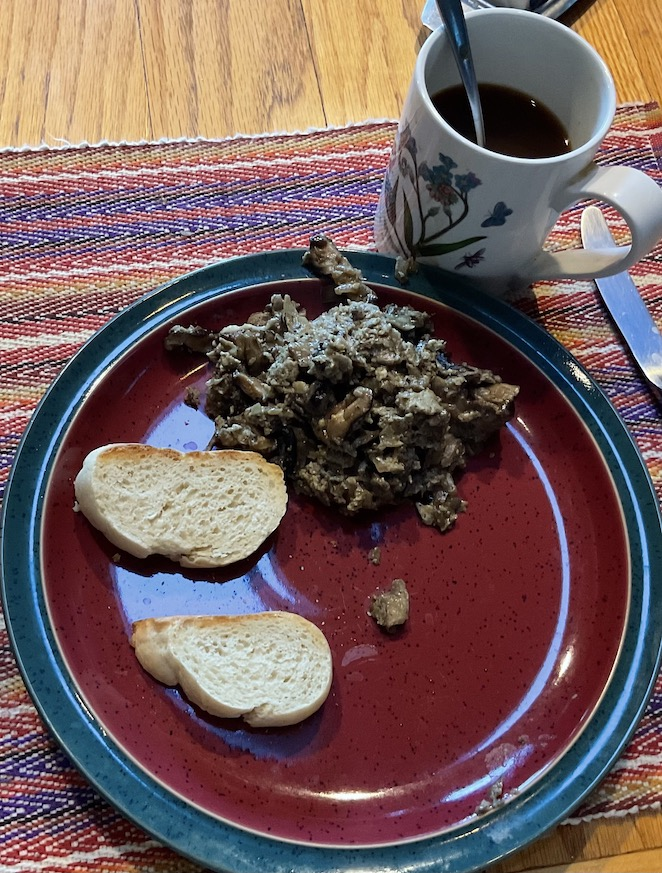

# Czech Republic

Czech breakfast: smaz&#774;enice with veka bread. This tasted way
better than it looks. Basically a mushroom scramble and some
sourdough. The bread recipe was a challenge to follow....

[smazenice recipe](https://www-houby--rostou-cz.translate.goog/smazenice-recept/?_x_tr_sl=auto&_x_tr_tl=en&_x_tr_hl=en) 
[bread recipe](https://www.cooklikeczechs.com/veka-bread-recipe/)

