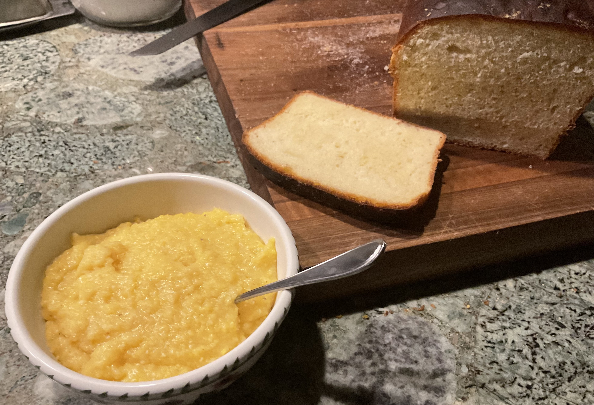

[prev](comoros.md)&emsp;
[top](../index.md)&emsp;
[next](roc.md)

# Democratic Republic of Congo
20 February, 2022

Congolese breakfast: maize porridge, coffee, and bread. This was a fun
bread recipe. The porridge is also popular in Uganda.

[maize porridge recipe](https://amunafoods.com/maize-meal-porridge/) 
[bread recipe](https://www.joaoleitao.com/african-bread-recipe-congo/)

