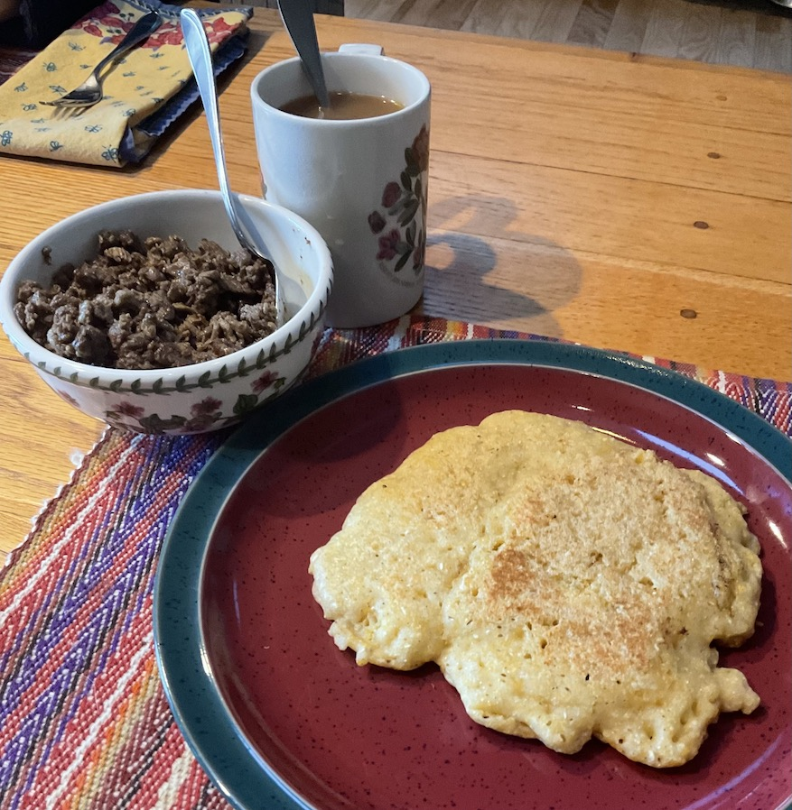

[prev](denmark.md)&emsp;
[top](../index.md)&emsp;
[next](dominica.md)
# Djibouti
24 April, 2022

Djiboutian breakfast: lahoh with coffee, oodkac. Both of these dishes
were great, but the oodkac (in the bowl) was amazing.  Made with beef,
as I was unable to source camel meat.

[lahoh recipe](https://www.196flavors.com/somalia-lahoh/) 
[oodkac recipe](https://sikiacooking.com/oodkac-recipe-jerky-style-beef-cubes/)

