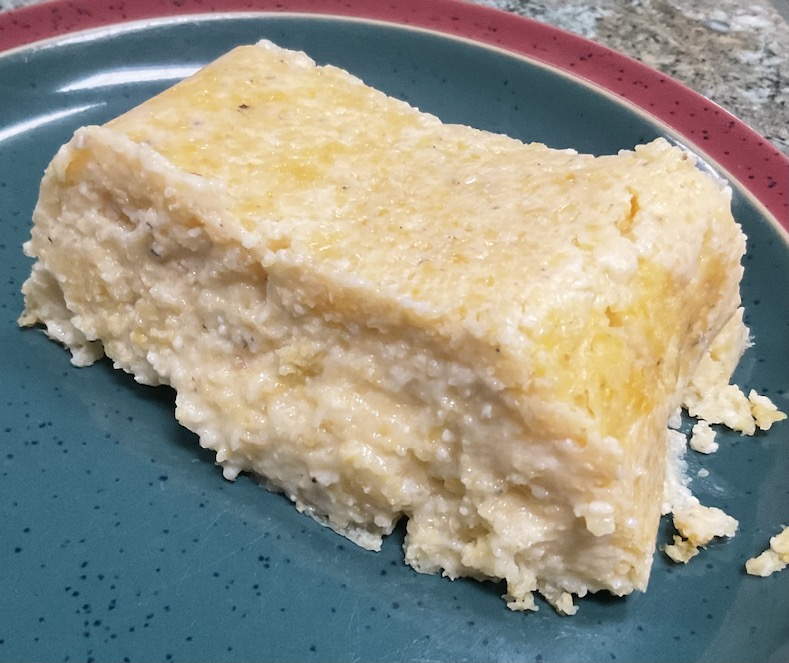

[prev](djibouti.md)&emsp;
[top](../index.md)&emsp;
[next](dominican_republic.md)
# Dominica
1 May, 2022

Dominican breakfast: arepa salada. Basically corn bread. My execution
was a little poor, but it tasted nice. I'm making a new recipe, for
the first time, for every entry in this blog; I don't get to practice.

[recipe](https://www.dominicancooking.com/15692/arepa-salada-dominican-savory-cornbread)

