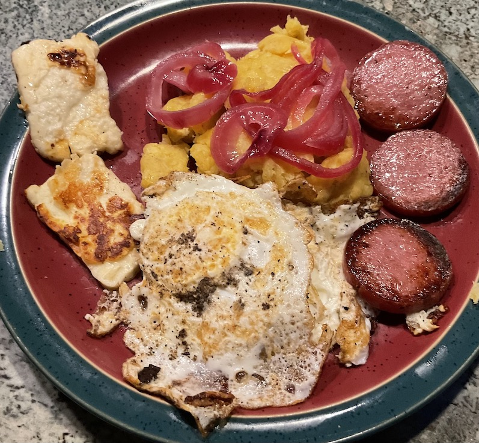

[prev](dominica.md)&emsp;
[top](../index.md)&emsp;
[next](../e/east_timor.md)

# Dominican Republic
8 May, 2022

Dominican breakfast: mangu&#769; con los tres golpes. This was a fun
one, with lots of different components. A little frenetic in the
kitchen at the end, when everything finished at the same time.

This dish is also eaten in Dominica, but I wanted to do different things for the two countries.

Three recipe links; I took some ideas from each.

[dominican breakfast recipe](https://tropicalcheese.com/recipes/breakfast/traditional-dominican-breakfast) 
[tres golpes recipe](https://www.sidechef.com/recipes/47485/mang_tres_golpes_dominican_breakfast/) 
[recipe video](https://youtu.be/THppTz5QDV8)

 