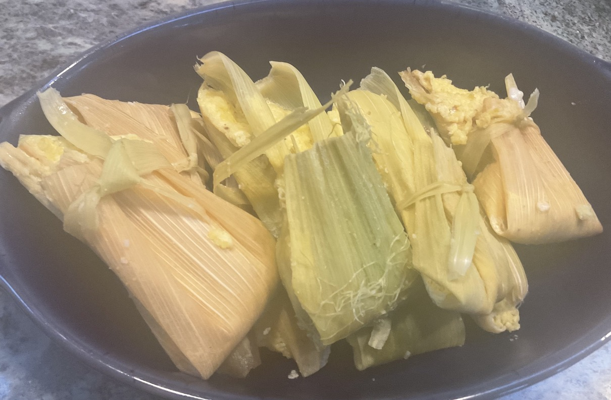

[prev](east_timor.md)&emsp;
[top](../index.md)&emsp;
[next](egypt.md)

# Ecuador
22 May, 2022

Ecuadorian breakfast: humitas. Essentially, these are the same as
tamales. Tedius to make, of course, but quite tasty. Hardest part is
tying the knots in the husk ribbons.

[recipe](https://www.laylita.com/recipes/traditional-ecuadorian-breakfast-dishes/)

