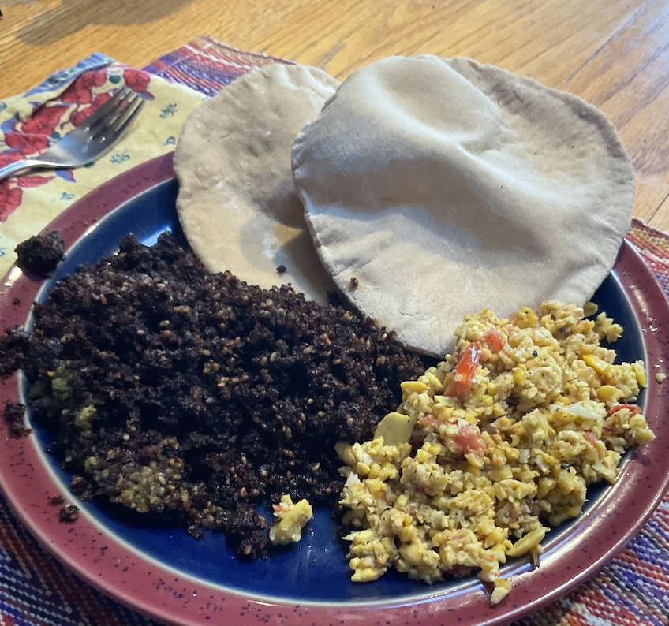

[prev](ecuador.md)&emsp;
[top](../index.md)&emsp;
[next](el_salvador.md)

# Egypt
29 May, 2022

Egyptian breakfast: foul and falafel. I had some trouble following
this recipe; my falafel just disintegrated in the oil. But the taste
was fabulous.

[falafel recipe](https://foodblend.wordpress.com/2012/05/29/fava-beans-and-falafel-%D9%81%D9%88%D9%84-%D9%88-%D8%B7%D8%B9%D9%85%D9%8A%D8%A9/) 
[flatbread recipe](https://www.saveur.com/aish-baladi-recipe/)

