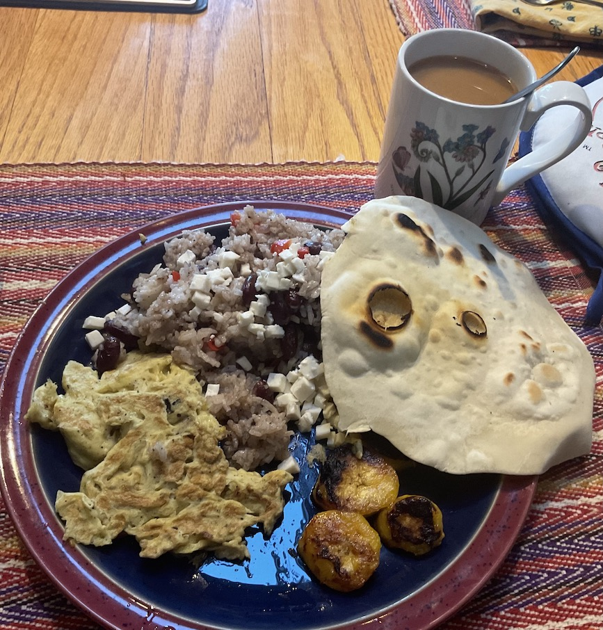

# El Salvador

Salvadoran breakfast: casamiento, with scrambled eggs, fried
plantains, and tortillas. Casamiento is a variation on red beans and
rice. So good.

[recipe](https://www.quericavida.com/recipes/salvadoran-breakfast-casamiento/8cb73ea3-c12f-4701-9bf3-84087f233587) 
[tortilla recipe](https://www.tasteofhome.com/recipes/homemade-tortillas/)

