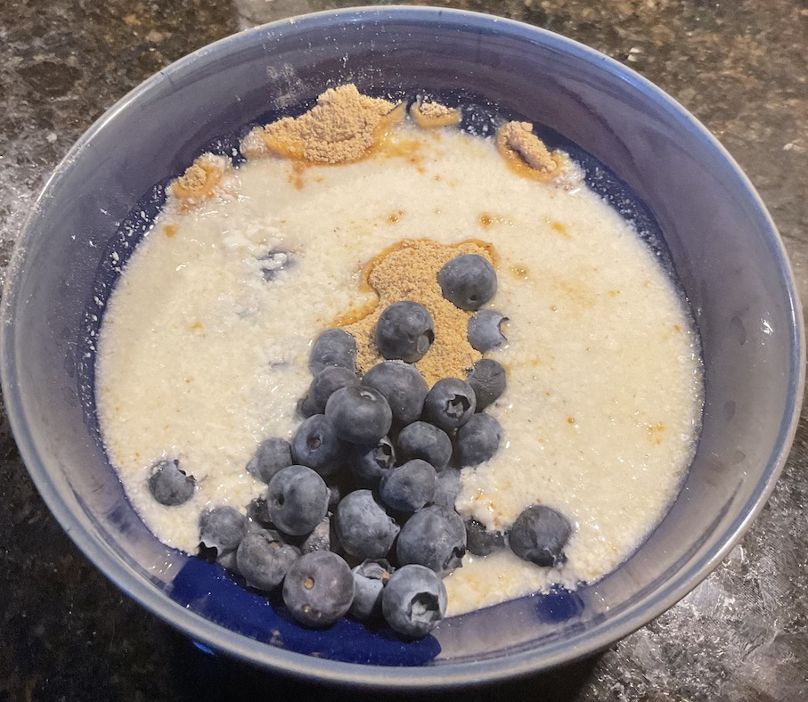

[prev](eritrea.md)&emsp;
[top](../index.md)&emsp;
[next](eswatini.md)

# Estonia
26 June, 2022

Estonian breakfast: kama. This was a lot of work, but the results were
well worth it. Delicious nutty breakfast cereal, very satisfying. And
even at the scale I made it (1 kg =&gt; 2 oz), it made enough for a week's
breakfasts.

[recipe](https://estoniancuisine.com/2017/08/11/kama-estonian-muesli/)

