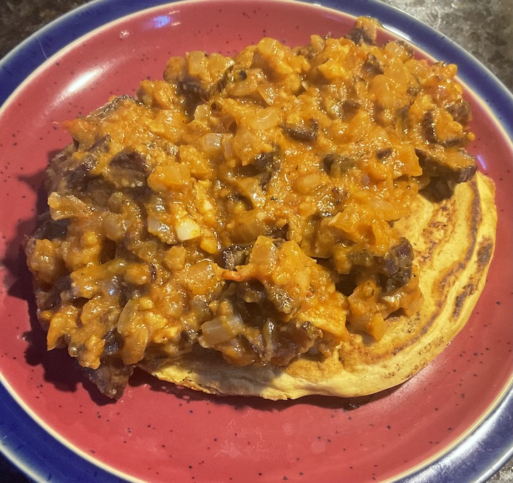

[prev](eswatini.md)
[top](../index.md)
[next](../f/fiji.md)
# Ethiopia
10 July, 2022

Ethiopian breakfast: firfir and injera. Firfir is a stew made from
tomatoes and dried beef. I really enjoyed eating this, though I doubt
the authenticity of my efforts to season it. Definitely kept us going
till lunch.

[firir recipe](https://www.allrecipes.com/recipe/254856/ethiopian-firfir-with-dried-beef-quanta-firfir/) 
[injera recipe](https://marcussamuelsson.com/recipe/injera)

