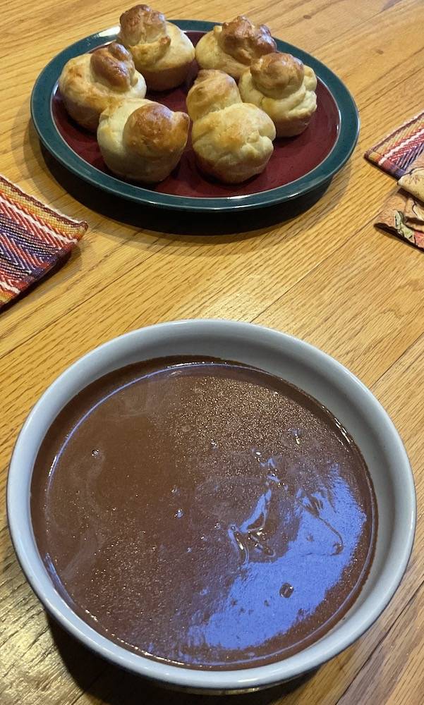

[prev](finland.md)&emsp;
[top](../index.md)&emsp;
[next](../g/gabon.md)
# France
31 July, 2022

French breakfast: hot chocolate with brioche a&#768; te&#770;te. The hot chocolate is cooked down to almost pudding consistency, then you dip the rolls in. Very decadent!

[recipe video](https://youtu.be/HTfokMC4Ho4) 
[recipe](https://www.thefrenchcookingacademy.com/recipes/french-hot-chocolate) 
The brioche recipe was from James Beard's _Beard on Bread_.

