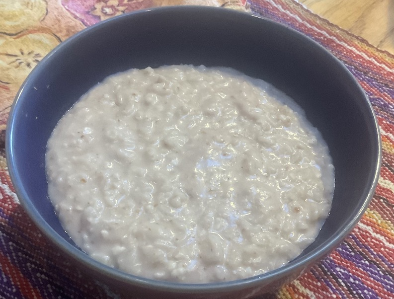

# Gambia

Gambian breakfast: chura gerte. Peanut rice porridge that was very
strange to my palate, but very enjoyable.

[recipe](https://www.rpcvmadison.org/cpages/the-gambia-2014-recipes-chura-gerte)

