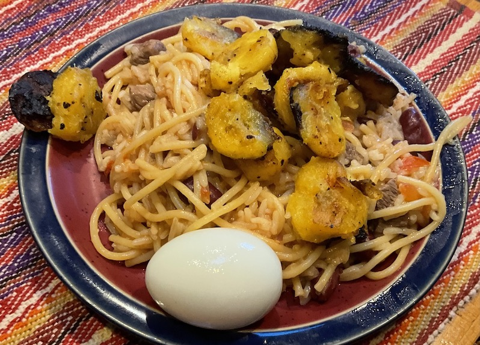

# Ghana

Ghanaian breakfast: waakye, with fried plantains and a hard boiled
egg. The Ghan version of rice and beans, with spaghetti and
plantains. What a great breakfast!

[recipe](https://afrifoodnetwork.com/recipes/rice-recipes/waakye-rice-and-beans/)

