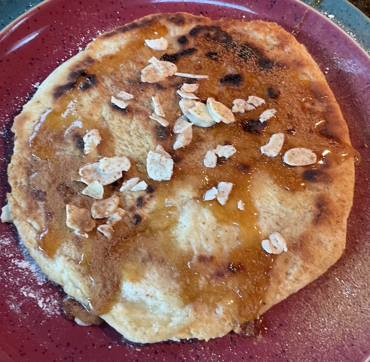

[prev](ghana.md)
[top](../index.md)
[next](grenada.md)
# Greece
11 September, 2022

Greek breakfast: sfakianoputa. (No idea how to pronounce it.) Sort of
a cross between pancake and coffee cake; makes a great pairing with
coffee for sure.

[recipe](https://www.lemonandolives.com/sfakianopita-cretan-cheese-pie-nuts-honey/)

