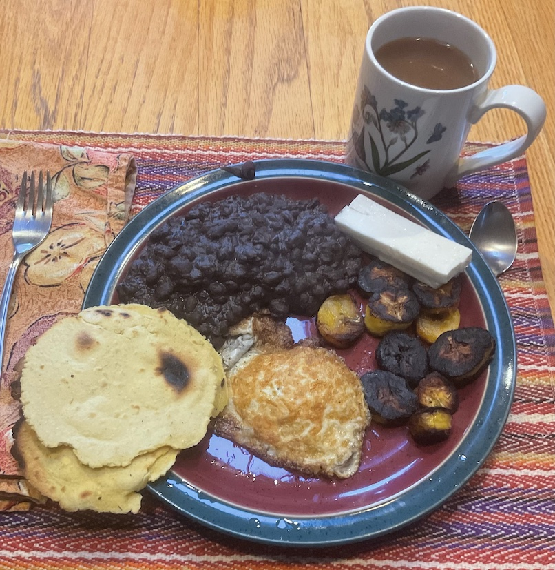

[prev](grenada.md)
[top](../index.md)
[next](guinea.md)
# Guatemala
25 September, 2022

Guatemalan breakfast: refried beans, plantains, egg, tortillas, queso
fresco, and coffee. I could easily eat this every day. Yum.

[black beans recipe](https://www.recipezazz.com/recipe/guatemalan-refried-black-beans-14579) 
[tortillas recipe](https://blog.unbound.org/2013/03/how-to-make-guatemalan-tortillas-recipe/)

