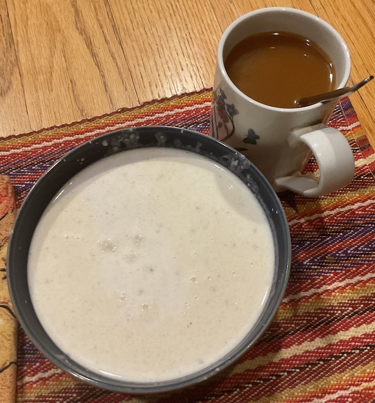

[prev](guinea.md)
[top](../index.md)
[next](guyana.md)
# Guinea-Bissau
9 October, 2022

Bissau-Guinean breakfast: chakery. This is a sweet, creamy porridge
made from couscous. Not my favorite breakfast, but it keeps you going!

[recipe](https://www.internationalcuisine.com/chakery)

