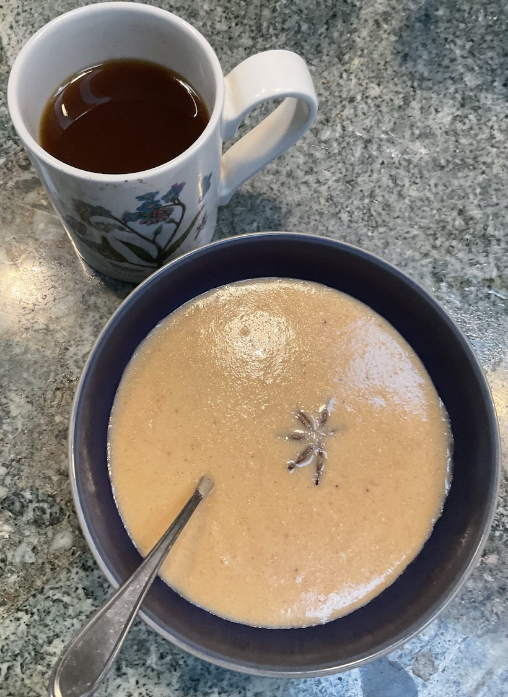

[prev](../g/guyana.md)
[top](../index.md)
[next](honduras.md)
# Haiti

Haitian breakfast: labouyi bannann. Porridge made from plantains. Spice mix was a fun addition.

[recipe](https://afrogistmedia.com/4-tasty-haitian-breakfast-recipes-you-should-try-out-haitian-cuisine)

