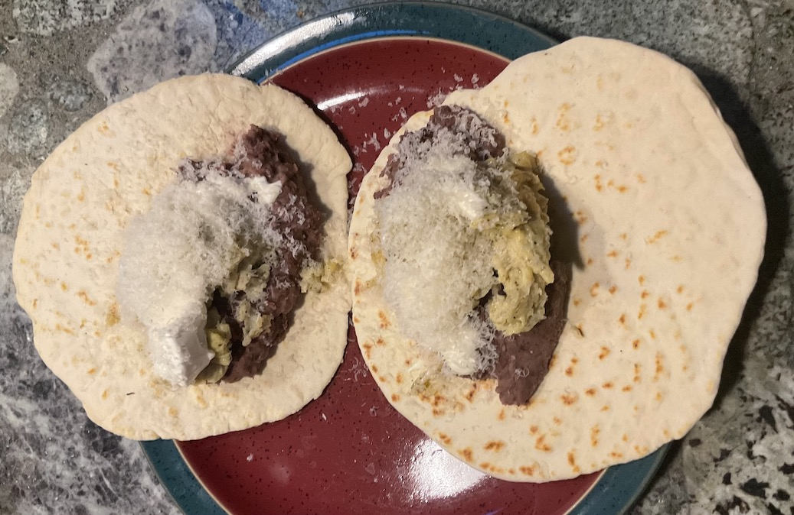

[prev](haiti.md)&emsp;
[top](../index.md)&emsp;
[next](hungary.md)

# Honduras
30 October, 2022

Honduran breakfast: baleadas. Basically bean tacos. Really yummy; my
presentation doesn't do it justice. If you're thinking about making
any of these breakfasts, this should be on your short list.

[baleadas recipe](https://www.curiouscuisiniere.com/honduran-baleadas/) 
[refried beans recipe](https://www.onehappyhousewife.com/authentic-refried-beans/)

