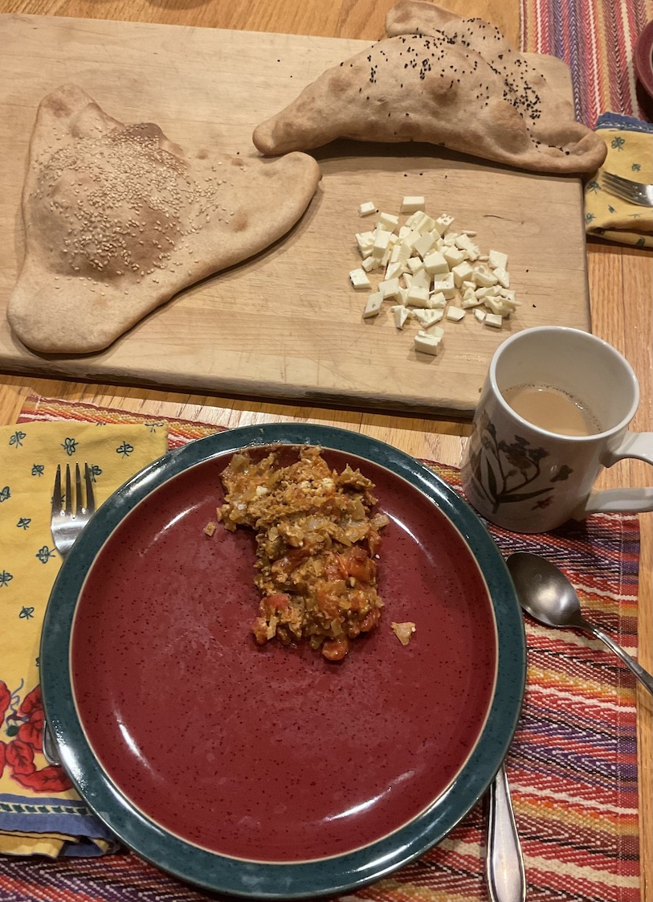

[prev](indonesia.md)&emsp;
[top](../index.md)&emsp;
[next](iraq.md)
# Iran
4 December, 2022

Iranian breakfast: sangak, feta, chai, omelette. Another fun set of
recipes to execute on. Who doesn't like triangular bread? If you're
curious about this cuisine, you should definitely try the omelette.

[flatbread recipe](https://thecaspianchef.com/2020/03/28/naan-sangak-persian-flatbread/) 
[chai recipe](https://www.archanaskitchen.com/irani-chai-recipe) 
[omelette recipe](https://food.ndtv.com/recipe-iranian-omelette-956648)

