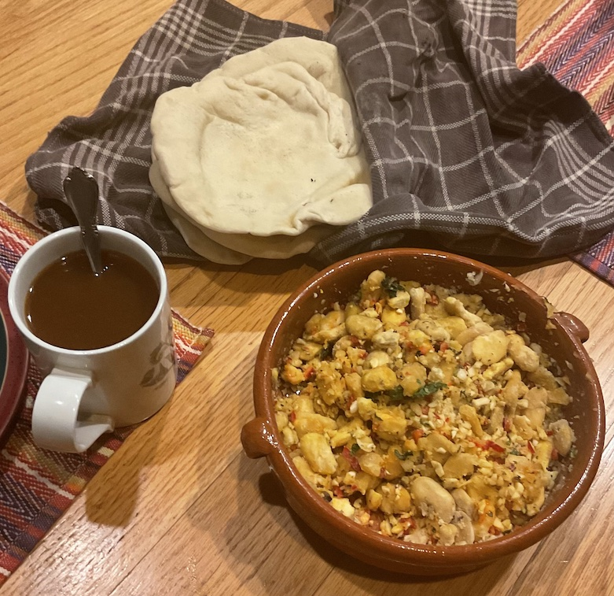

[prev](iran.md)&emsp;
[top](../index.md)&emsp;

# Iraq
11 December, 2022

Iraqi breakfast: bigilla and khubz. Khubz is basically pita, great
for tearing off pieces and picking up the bigilla. Bigilla is very
garlicky and (at least the version I made was) a bit dry, so the
coffee was essential for enjoying this meal.  On the whole, though
very enjoyable, and I'd be happy to eat this again.

[khubz recipe](https://www.epicurious.com/recipes/food/views/khubz-373563) 
[bagilla recipe](https://www.malta.com/en/dining/maltese-specialities/bigilla-recipe)

