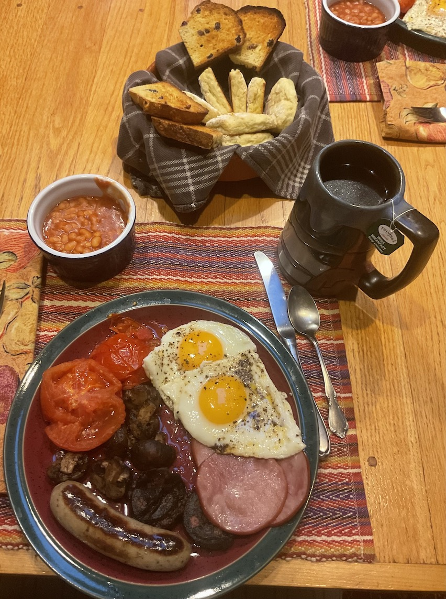

[prev](iraq.md)&emsp;
[top](../index.md)&emsp;
# Ireland
18 December, 2022

Irish breakfast: full Irish breakfast. Irish soda bread, Irish potato
bread, Heinz beans, fried eggs, back bacon, black pudding, grilled
mushrooms, grilled tomatoes, Irish bangers, and Irish breakfast tea.  So two
breads and 5 proteins. We didn't have any appetite for lunch, but
this was a total hoot. A little crazy in the kitchen at the end when
everything started to finish cooking at once.

This was my first time tasting black pudding, and I thought I would
hate it. I didn't, but it was not something I particularly enjoyed. I
don't understand the appeal, but some folks love it. I suppose I'll
have to eat it again when I get to the United Kingdom.

[full irish breakfast](https://www.mashed.com/759768/traditional-irish-breakfast-recipe/) 
[potato bread recipe](https://www.thespruceeats.com/fadge-irish-potato-bread-recipe-435235) 
[soda bread recipe](https://www.tasteofhome.com/recipes/classic-irish-soda-bread/)

