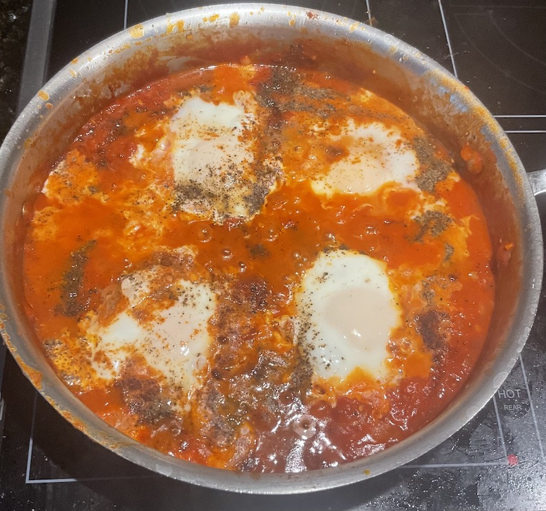

[prev](ireland.md)&emsp;
[top](../index.md)&emsp;
[next](italy.md)
# Israel
24 December, 2022

Israeli breakfast: shakshuka. Eggs poached in tomatoes. It sounds
boring, but it really isn't. This is an easy breakfast to make, and if
you haven't tried it, I highly recommend it. Make sure you use high
quality tomatoes; this is not the place to pinch pennies.

[recipe](https://www.thetasteofkosher.com/authentic-israeli-shakshuka/)

