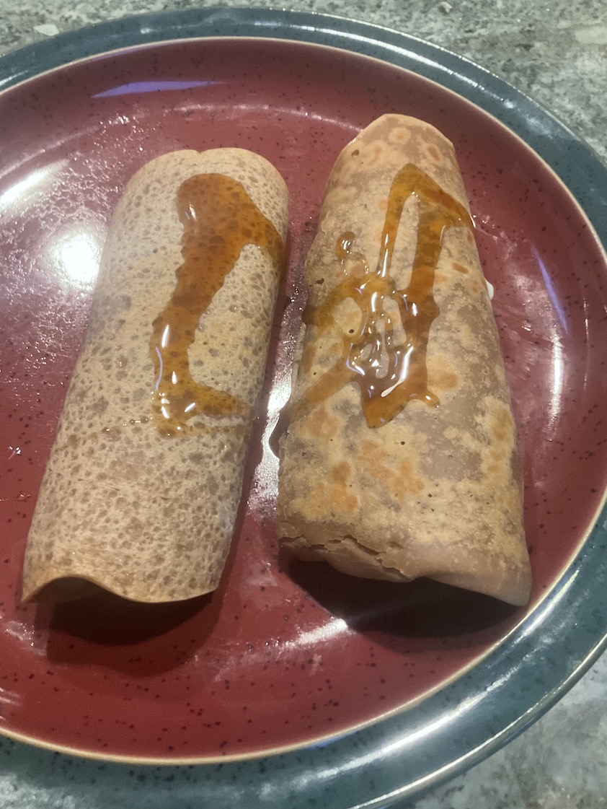

[prev](israel.md)&emsp;
[top](../index.md)&emsp;
[next](../j/jamaica.md)
# Italy
1 January, 2023

Italian breakfast: necci. Pancakes made with chestnut flour, and then
filled with ricotta and honey. Delicious. My wife says I have to make
them again later this week, since we have extra chestnut flour and
ricotta.  I'm not complaining.

[recipe](https://www.greatitalianchefs.com/recipes/necci-recipe-chestnut-flour-pancakes)

