# Breakfast from every country in the world

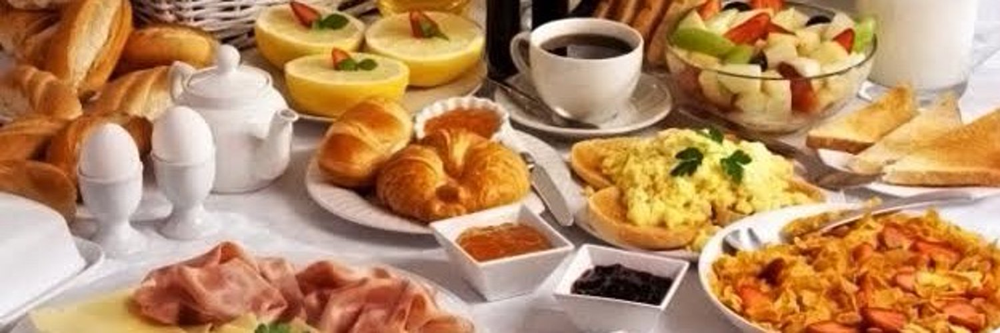

I started this project on the 30th of May, 2021. My pledge to myself
was that I would make breakfast for my wife and myself every Sunday,
once each from every country in the UN offical list of world
countries. I decided to do it in alphabetical order, so that I
wouldn't get fatigued by any region. It's been a delightful journey,
and I hope you enjoy reading about it.

Here is a complete list of the countries. If there isn't a link for
it, it's because I haven't gotten there yet.

Because of the way I'm publishing this, there's no way to get notices
from here about updates, or to comment on the posts. If you want to
reach out, I'm Zen Zero on [mastodon](https://sfba.social/@xvf17).  I
will also post from there when there are new entries here, so you can
follow me for updates if you like.

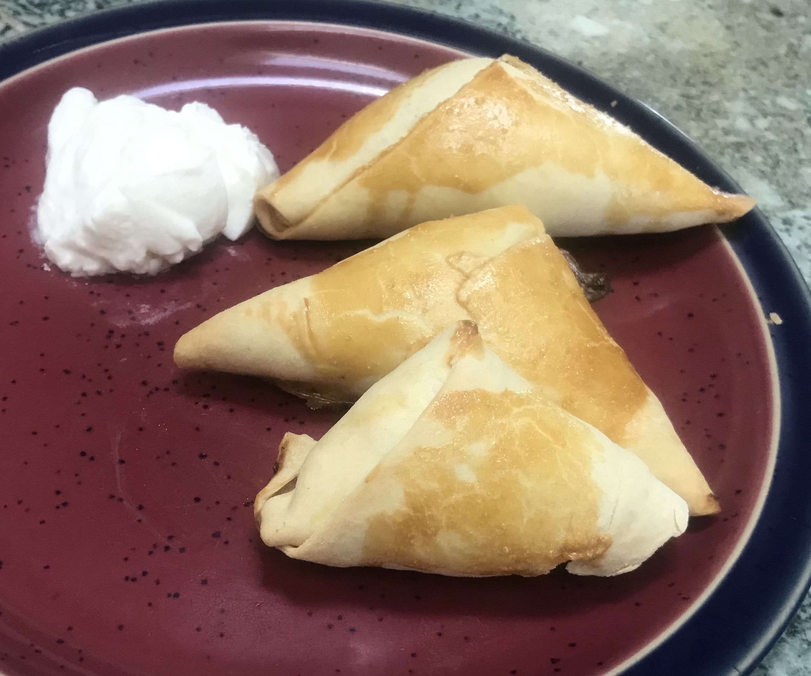

* [Afghanistan](a/afghanistan.md) - pilaf with chicken parts, candied carrots, and
raisins
* [Albania](a/albania.md) - byrek
* [Algeria](a/algeria.md) - mshewsha
* [Andorra](a/andorra.md) - truites de carreroles
* [Angola](a/angola.md) - funje, bananas, mangoes, pineapple
* [Antigua and Barbuda](a/antigua_and_barbuda.md) - ducana and salt fish
* [Argentina](a/argentina.md) - catamarquean empanadas
* [Armenia](a/armenia.md) - tomatoes and eggs
* [Australia](a/australia.md) - toast with Vegemite
* [Austria](a/austria.md) - tiroler groestl
* [Azerbaijan](a/azerbeijan.md) - tandoori bread, feta, curd cheese, jam


* [The Bahamas](b/bahamas.md) - chicken souse, Johnny cake
* [Bahrain](b/bahrain.md) - chai haleeb, balaleet, nikhee
* [Bangladesh](b/bangladesh.md) - chapri, potato cury
* [Barbados](b/barbados.md) - conkies
* [Belarus](b/belarus.md) - draniki, sour cream
* [Belgium](b/belgium.md) - waffles
* [Belize](b/belize.md) - fried eggs, refried beans, fry jacks
* [Benin](b/benin.md) - akara, baked yam, peanut sauce
* [Bhutan](b/bhutan.md) - red rice porridge
* [Bolivia](b/bolivia.md) - embanadas, licuado
* [Bosnia and Herzegovina](b/bosnia.md) - cimbur, pita
* [Botswana](b/botswana.md) - breakfast porridge
* [Brazil](b/brazil.md) - misq quente, pingado
* [Brunei](b/brunei.md) - brench toast and Kaya
* [Bulgaria](b/bulgaria.md) - banitsa
* [Burkina Faso](b/burkina_faso.md) - coffee, fried egg, and fresh French-style baguette
* [Burundi](b/burundi.md) - bean and plantain stew, toast, coffee

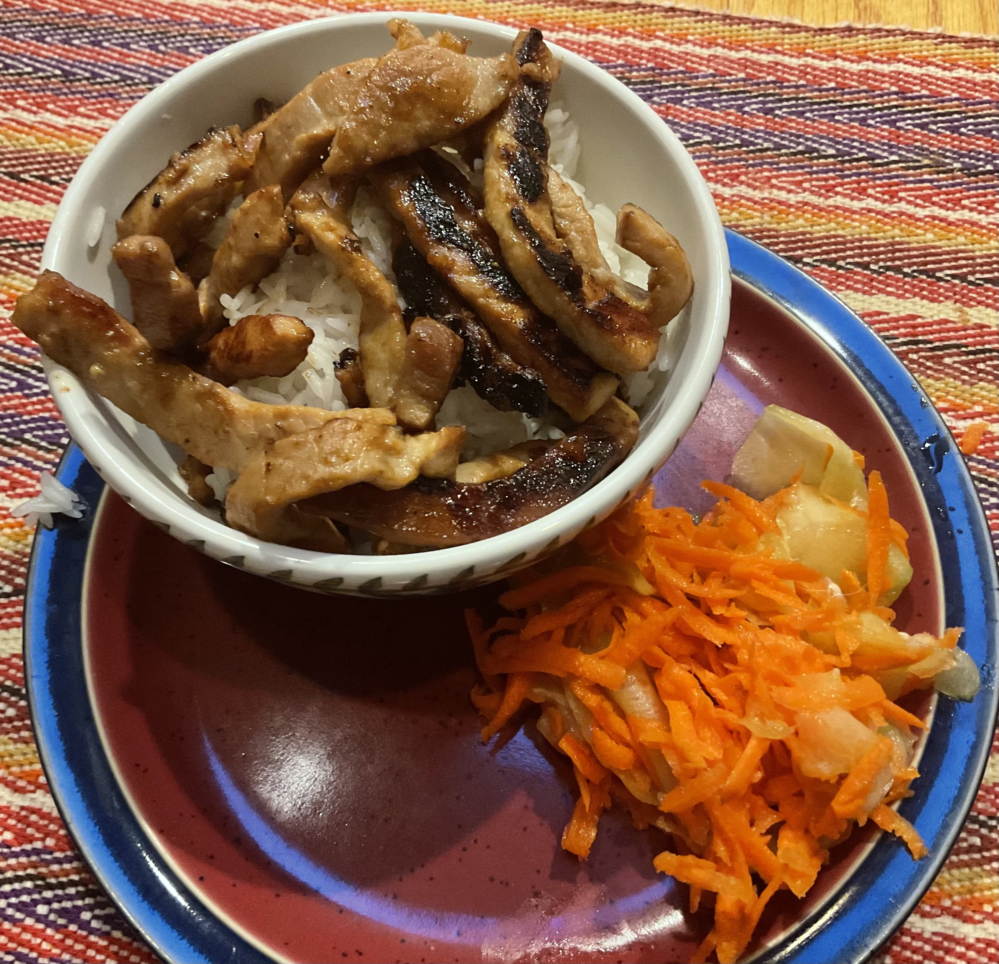

* [Cabo Verde](c/cabo_verde.md) - cachupa guisado
* [Cambodia](c/cambodia.md) - bai sach chrouk
* [Cameroon](c/cameroon.md) - puff puffs
* [Canada](c/canada.md) - bacon, eggs over easy, and hash browns
* [Central African Republic](c/car.md) - chichinga beef kebab
* [Chad](c/chad.md) - La bouillie
* [Chile](c/chile.md) - ulpo, toast, coffee
* [China](c/china.md) - red bean paste steamed buns
* [Colombia](c/colombia.md) - Changua
* [Comoros](c/comoros.md) - mkatra foutra
* [Congo, Democratic Republic of the](c/droc.md) - maize porridge, coffee and bread
* [Congo, Republic of the](c/roc.md) - beignets
* [Costa Rica](c/costa_rica.md) - choreadas, coffee, gallo pinto, lizano sauce
* [Côte d’Ivoire](c/cote_divoire.md) - Attiéké (aka Garba) w/ roast chicken
* [Croatia](c/croatia.md) - Burek
* [Cuba](c/cuba.md) - Coffee, fruit (plantain, mango), pan de gloria
* [Cyprus](c/cyprus.md) - prozymi bread, fried eggs, halloumi, speck
* [Czech Republic](c/czech.md) - smaženice with veka bread

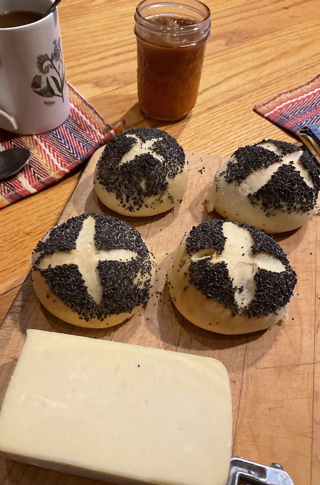

* [Denmark](d/denmark.md) - Rundstykker with havarti, jam, and coffee
* [Djibouti](d/djibouti.md) - lahoh with coffee, oodkac
* [Dominica](d/dominica.md) - Arepa Salada
* [Dominican Republic](d/dominican_republic.md) - los tres golpes

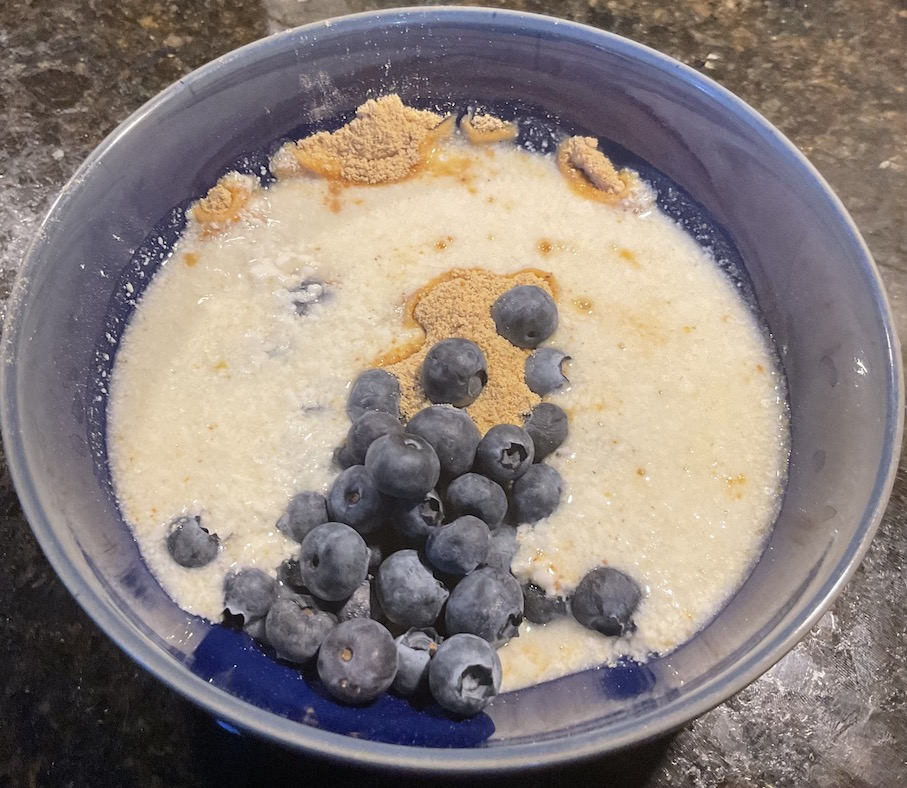

* [East Timor](e/east_timor.md) (Timor-Leste) - kape at pandesal
* [Ecuador](e/ecuador.md) - humitas
* [Egypt](e/egypt.md) - foul and falafel
* [El Salvador](e/el_salvador.md) - casamiento
* [Equatorial Guinea](e/equatorial_guinea.md) - akwadu
* [Eritrea](e/eritrea.md) - shaman ful with fried egg
* [Estonia](e/estonia.md) - Kama
* [Eswatini](e/eswatini.md) - Sishwala
* [Ethiopia](e/ethiopia.md) - firfir and njera

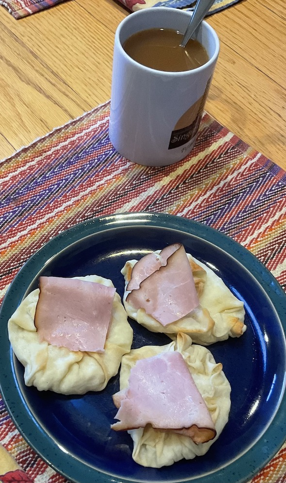

* [Fiji](f/fiji.md) - babakao
* [Finland](f/finland.md) - karjalan pies (with ham)
* [France](f/france.md) - hot chocolate w/ brioche

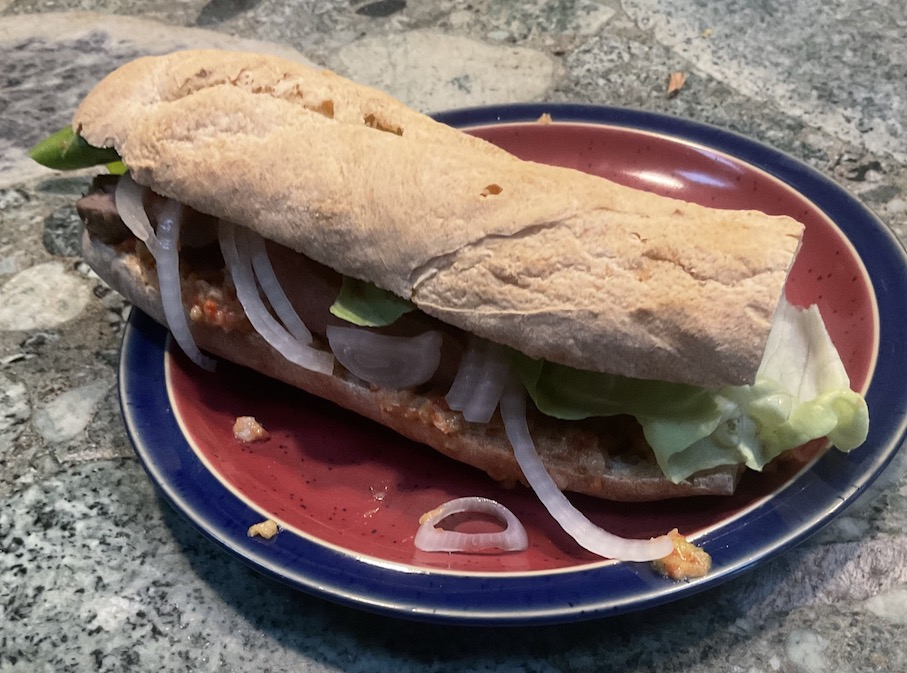

* [Gabon](g/gabon.md) - coupé-coupé
* [The Gambia](g/gambia.md) - Chura Gerte
* [Georgia](g/georgia.md) - Chirbuli
* [Germany](g/germany.md) - Potato Omelet with toast and jam
* [Ghana](g/ghana.md) - waakye with hard boiled eggs
* [Greece](g/greece.md) - Sfakianoputa
* [Grenada](g/grenada.md) - oat coconut bake, cocoa ball tea, fried plantains
* [Guatemala](g/guatemala.md) - black beans, fried plantain slices, fresh cheese, eggs, tortillas
* [Guinea](g/guinea.md) - beignet de poisson
* [Guinea-Bissau](g/guinea_bissau.md) - chakery
* [Guyana](g/guyana.md) - rock buns

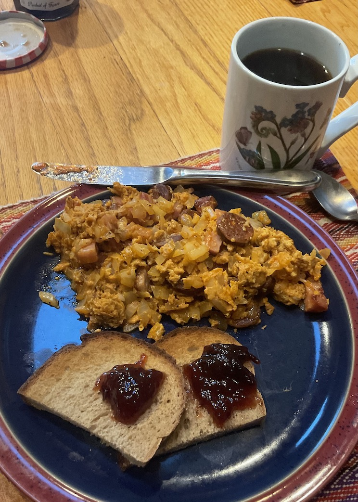

* [Haiti](h/haiti.md) - Labouyi Bannann
* [Honduras](h/honduras.md) - Baleadas
* [Hungary](h/hungary.md) - Búbos rántotta

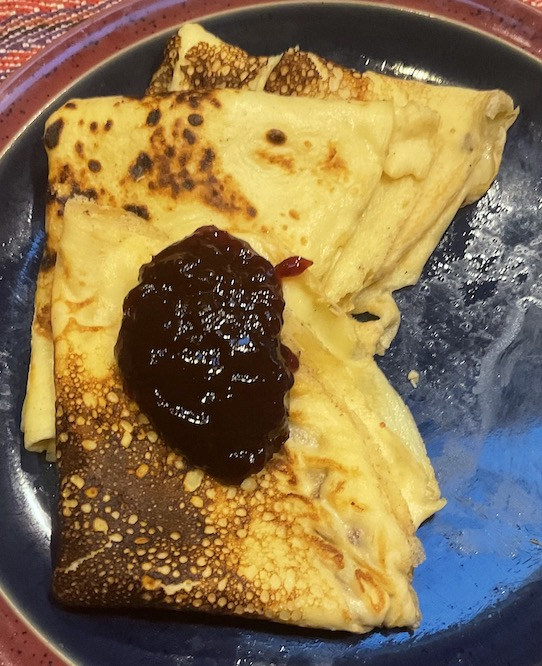

* [Iceland](i/iceland.md) - Pönnukökur
* [India](i/india.md) - Aloo Paratha
* [Indonesia](i/indonesia.md) - Bubur ayam with peanut sauce
* [Iran](i/iran.md) - sangak, feta, chai, omelet
* [Iraq](i/iraq.md) - Bigilla and Khubz
* [Ireland](i/ireland.md) - Full Irish Breakfast
* [Israel](i/israel.md) - shakshuka
* [Italy](i/italy.md) - necci

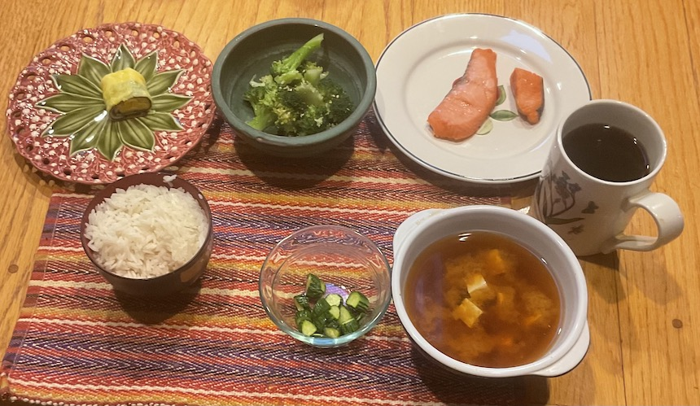

* [Jamaica](j/jamaica.md) - porridge
* [Japan](j/japan.md) - traditional Japanese breakfast
* [Jordan](j/jordan.md) - foul mudummas, shrak, halawa

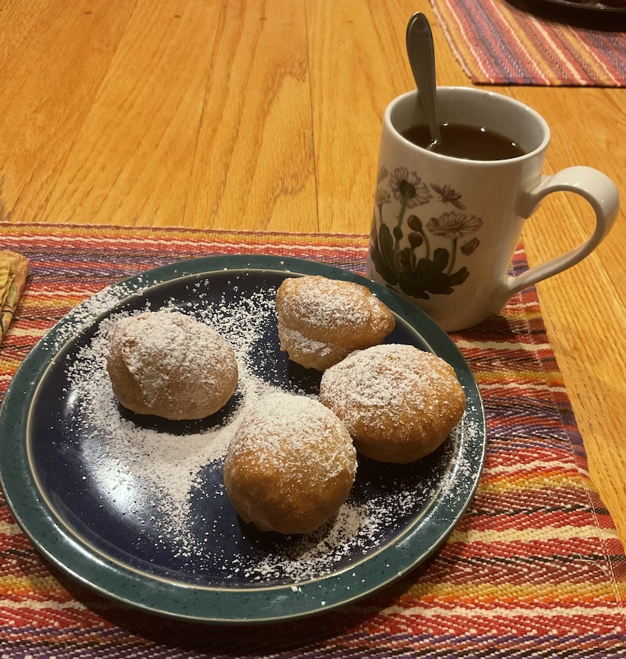

* [Kazakhstan](k/kazakhstan.md) - baursaki
* [Kenya](k/kenya.md) - cr&ecirc;pes
* [Kiribati](k/kiribati.md) - milk rice
* [Korea, North](k/north_korea.md) - corn congee
* [Korea, South](k/south_korea.md) - street toast
* [Kosovo](k/kosovo.md) - llokuma
* [Kuwait](k/kuwait.md) - balaleet
* [Kyrgyzstan](k/kyrgyzstan.md) - blini

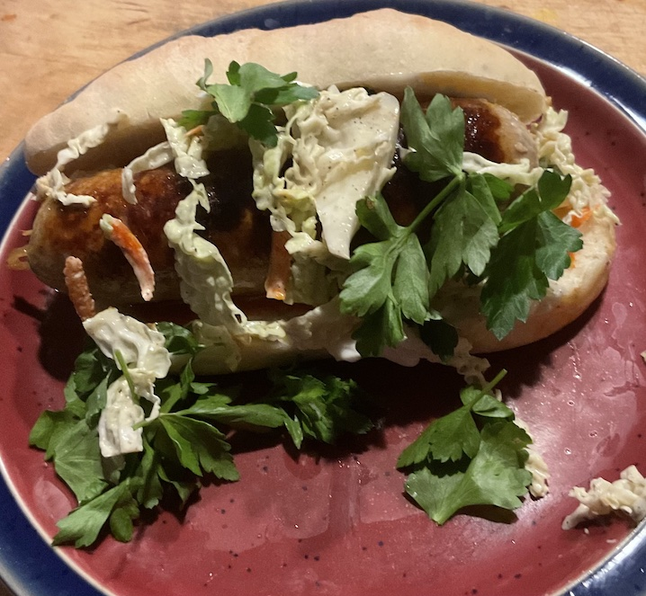

* [Laos](l/laos.md) - khao jee
* [Latvia](l/latvia.md) - apple pancakes
* [Lebanon](l/lebanon.md) - fattet hummus and eggs
* [Lesotho](l/lesotho.md) - makoenva
* [Liberia](l/liberia.md) - moni kalama
* [Libya](l/libya.md) - asida
* [Liechtenstein](l/liechtenstein.md) - tatsch
* [Lithuania](l/lithuania.md) - bundukies
* [Luxembourg](l/luxembourg.md) - gebeeseschmier

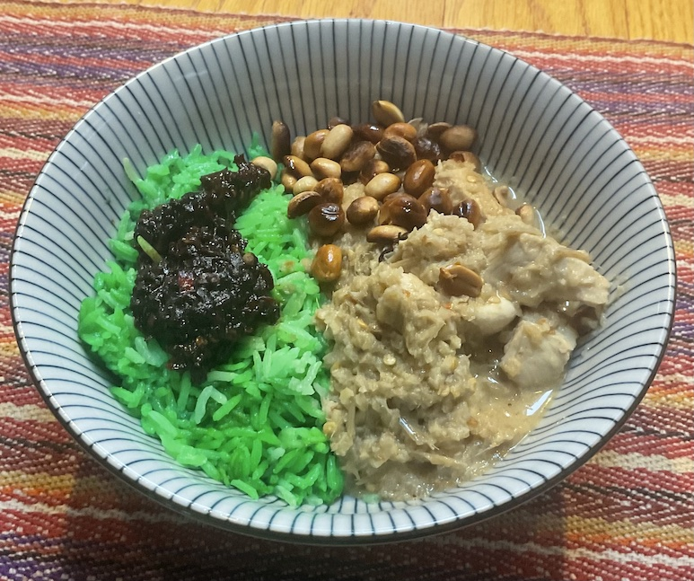

* [Madagascar](m/madagascar.md) - mofo baolina
* [Malawi](m/malawi.md) - futali
* [Malaysia](m/malaysia.md) - nasi lemak, sambal, fried peanuts, chicken rendang
* [Maldives](m/maldives.md) - mas huni, chapati
* [Mali](m/mali.md) - maasa
* [Malta](m/malta.md) - pastizzi
* [Marshall Islands](m/marshall_islands.md) - Donat
* Mauritania - mbourou wetay
* Mauritius - egg rougaille with roti
* Mexico - machaca
* Micronesia, Federated States of - uht sukusuk
* Moldova - branzoaice
* Monaco - croissants, bread, cheese, ham, eggs, coffee
* Mongolia - milk tea, boortsorg, urum
* Montenegro - ka&#774;amak
* Morocco - beghrir, mint tea
* Mozambique - sandes de queijo
* Myanmar - Burmese egg curry
* Namibia
* Nauru
* Nepal
* Netherlands
* New Zealand
* Nicaragua
* Niger
* Nigeria
* North Macedonia
* Norway
* Oman
* Pakistan - manakeesh
* Palau
* Palestine
* Panama
* Papua New Guinea
* Paraguay
* Peru
* Philippines
* Poland
* Portugal
* Qatar
* Romania
* Russia
* Rwanda
* Saint Kitts and Nevis
* Saint Lucia
* Saint Vincent and the Grenadines
* Samoa
* San Marino
* Sao Tome and Principe
* Saudi Arabia
* Senegal - ndambe
* Serbia
* Seychelles
* Sierra Leone
* Singapore
* Slovakia
* Slovenia
* Solomon Islands
* Somalia - malawah
* South Africa
* Spain
* Sri Lanka
* Sudan
* Sudan, South
* Suriname
* Sweden
* Switzerland
* Syria
* Taiwan
* Tajikistan
* Tanzania
* Thailand
* Togo
* Tonga
* Trinidad and Tobago
* Tunisia
* Turkey
* Turkmenistan
* Tuvalu
* Uganda
* Ukraine - deruny
* United Arab Emirates
* United Kingdom - full English breakfast
* United States - biscuits and gravy
* Uruguay
* Uzbekistan
* Vanuatu
* Vatican City
* Venezuela
* Vietnam
* Yemen
* Zambia
* Zimbabwe
```````