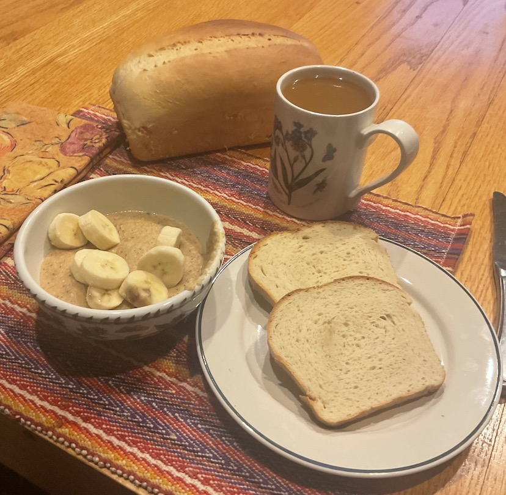

[prev](../i/italy.md)&emsp;
[top](../index.md)&emsp;
[next](japan.md)
# Jamaica
<meta property="og:image" content="images/jamaica.png"/>
8 January, 2023

Jamaican breakfast: cornmeal porridge and hard dough bread. Not sure
why they call this "hard dough" bread; the dough is very soft, and the
resulting bread is very pillowy.  The porridge was pretty good, but it
really needed the fresh fruit topping. This was an easy one to
prepare, so if you are thinking about trying any of these, this would
be a good place to start.

[bread recipe](https://jamaicans.com/hbread/) 
[porridge recipe](https://jamaicans.com/cporridge/)

