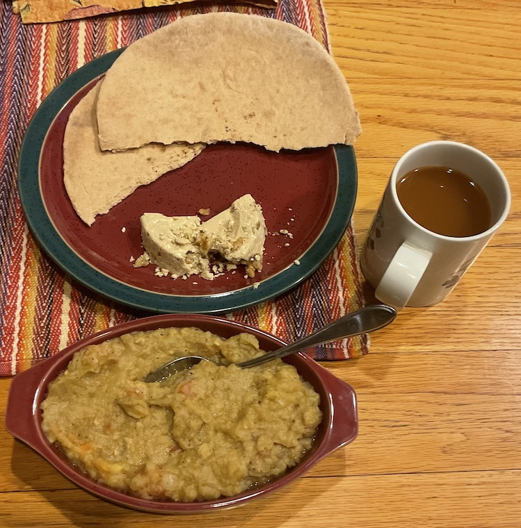

[prev](japan.md)&emsp;
[top](../index.md)&emsp;
[next](../k/kazakhstan.md)
# Jordan
<meta property="og:image" content="images/jordan.png"/>
22 January, 2023

Jordanian breakfast: foul mudummas, shrak, halva. I have made foul
several times for this project, and this was by far the best. I
suppose the practice helps, but I think this recipe was clearer than
others I've found as well. The trick is to let the fava beans cook
out.

Foul is basically hummus, but with fava beans. The halva is a crumbly
candy (like nougat) that is often sold in jewish delis. My wife grew
up eating it; I'd never heard of it until this meal.

[shrak recipe](https://www.internationalcuisine.com/jordanian-shrak/) 
[foul recipe](https://www.cheftariq.com/recipe/foul-mudammas/) 
[halva recipe](https://amiraspantry.com/halva-recipe/)

