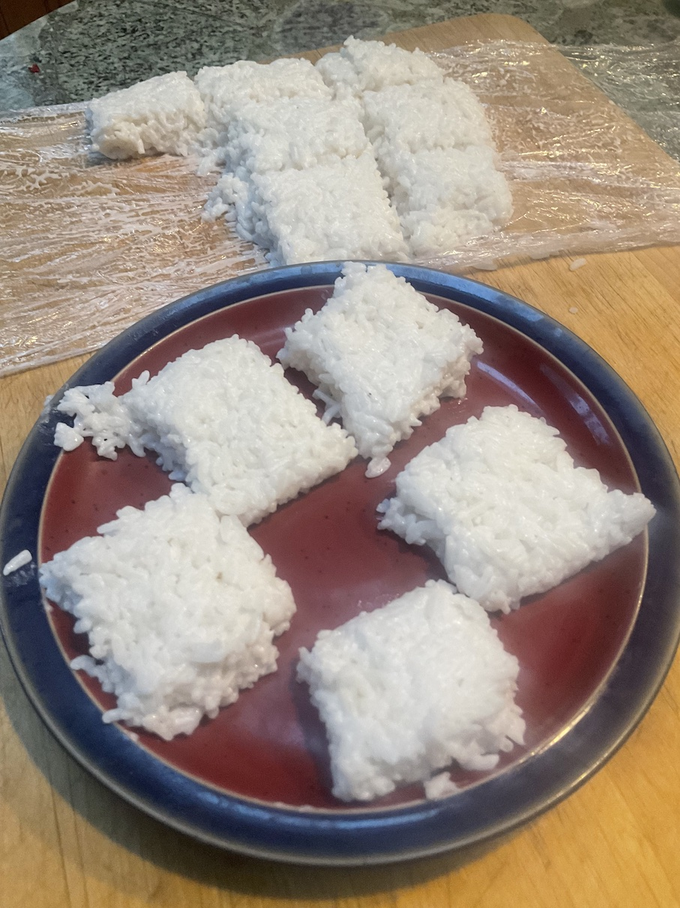

[prev](kenya.md)&emsp;
[top](../index.md)&emsp;
[next](north_korea.md)
# Kiribati
<meta property="og:image" content="images/kiribati.png"/>
12 February, 2023

I-Kiribati breakfast: milk rice. This is mostly just a mixture of rice
and coconut milk, and I found the flavor to be pretty one-note. To be
fair, I think it is often served as a side dish rather than on its
own, so I probably didn't see it at its best.

[recipe](https://hungrylankan.com/recipes/kiribath-sri-lankan-milk-rice/)

