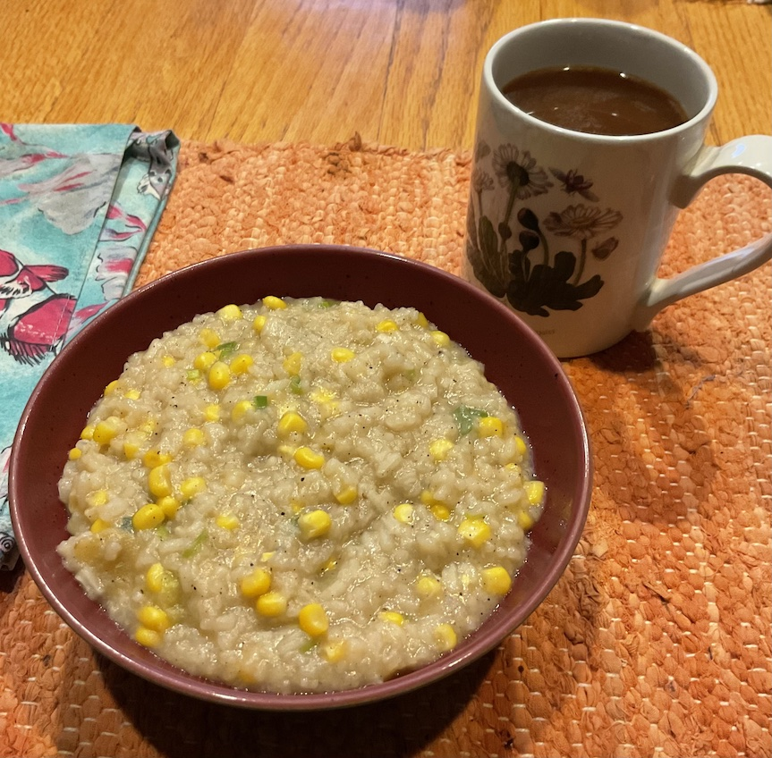

[prev](kiribati.md)&emsp;
[top](../index.md)&emsp;
[next](south_korea.md)
# North Korea
19 February, 2023

North Korean breakfast: sweet corn congee. This takes a while to make,
but it's not complicated, and the results are quite tasty. Corn and
rice porridge is probably the best description.

[recipe](https://www.foodandwine.com/recipes/sweet-corn-congee)

