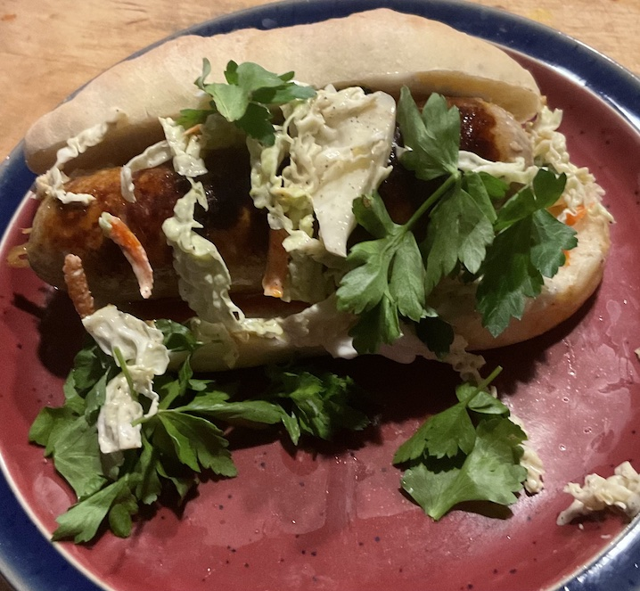

[prev](../k/kyrgyzstan.md)&emsp;
[top](../index.md)&emsp;
[next](latvia.md)
# Laos
26 March, 2023

Lao breakfast: khao jee. Delicious sausage sandwich. I doubt if the
bollillo roll is traditional, but the recipe author recommended it so
I went along. I preordered the sausages on line, but discovered after
they arrived that it was just a spice mix, so I had to mix and stuff
the sausages myself. If you ever try this recipe, I highly recommend
you make patties instead of stuffing into casings.

Cole slaw was home made as well, but no recipe link; it was pretty generic.

[sandwich recipe](https://www.simplecomfortfood.com/2019/11/07/khao-jee-laotion-sandwich/)
[bolillos recipe](https://www.kingarthurbaking.com/recipes/bolillos-recipe)

