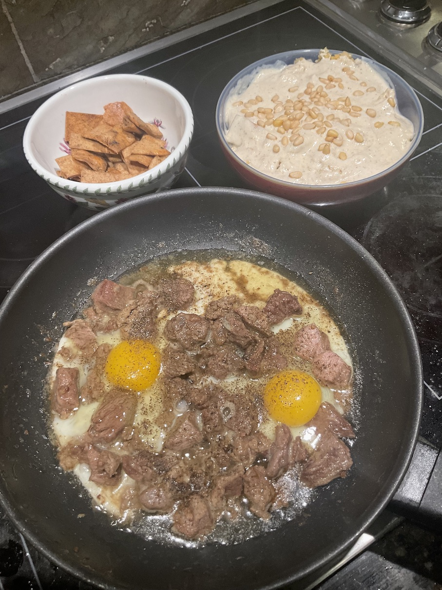

[prev](latvia.md)&emsp;
[top](../index.md)&emsp;
[next](lesotho.md)
# Lebanon
9 April, 2023

Lebonese breakfast: fattet humous and kawarma with eggs. This was
absolutely delicious, and very filling. We couldn't finish, even
though the recipes said I was making two servings. Not terribly
difficult to make, though it was fairly time consuming; I had to start
on Saturday for a Sunday breakfast.

[recipes](https://www.vivarecipes.com/videos/breakfast/4-amazing-lebanese-breakfast-dishes/)
Pita bread was from _Flatbreads &amp; Flavors_ by Jeffrey Alford and Naomi Duguid.

