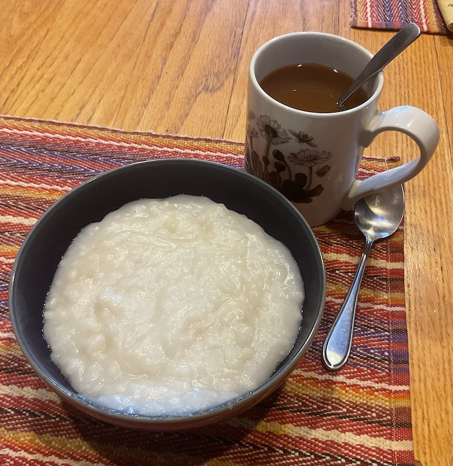

[prev](lesotho.md)&emsp;
[top](../index.md)&emsp;
[next](libya.md)
# Liberia
23 April, 2023

Liberian breakfast: moni kalama (rice flour porridge). This recipe was
a challenge to work with, because the amounts were very vague and the
technique for the rice balls was a little under-specified.  But
something magical happened when the lime was added, and it came out
very yummy!

I did 4 oz of rice flour per person, which was a little too much. I
think 3 would work better.

[recipe](https://www.okrapantry.com/2022/06/16/moni-kalama-liberian-breakfast-porridge/)

