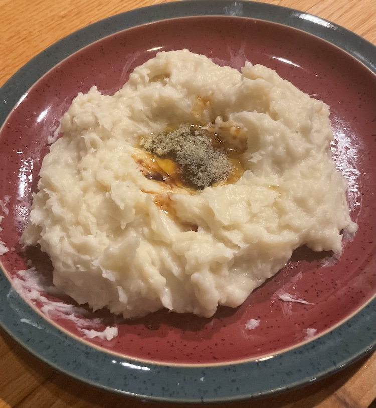

[prev](liberia.md)&emsp;
[top](../index.md)&emsp;
[next](liechtenstein.md)
# Libya
30 April, 2023

Libyan breakfast: asida. This was not my favorite breakfast. I don't
think I made it right, because what I made doesn't look anything like
the pictures in the recipe (I think there was too much water), but the
texture was very off-putting, and I definitely didn't enjoy it.  It
was interesting to try date syrup, though. That was a new thing for
me.

[recipe](http://libyanfood.blogspot.com/2011/10/asida.html)

