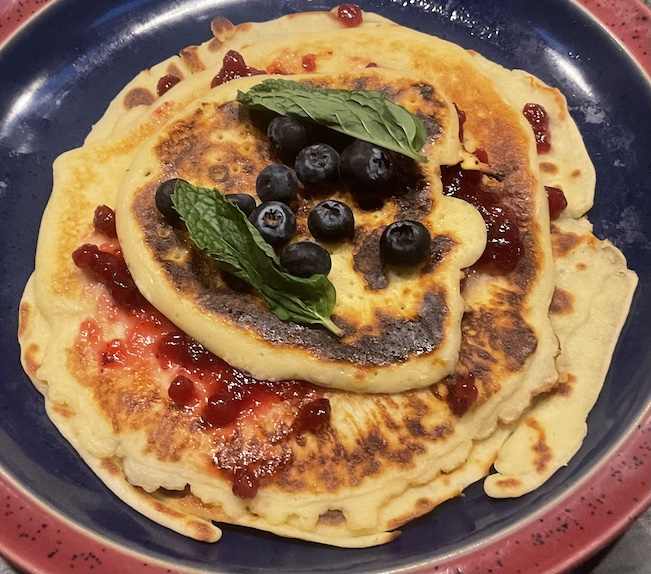

[prev](libya.md)&emsp;
[top](../index.md)&emsp;
[next](lithuania.md)
# Liechtenstein
<meta property="og:image" content="images/liechtenstein.png"/>
7 May, 2023

Liechtensteiner breakfast: tatsch (aka pfannkuchen). Pancakes with
fruit preserves, fresh berries and mint on top. Delicious. In my
version, we used lingonberries again (see [the icelandic
breakfast](../i/iceland.html)) because my wife is crazy about them now.

[recipe](https://www.internationalcuisine.com/liechtensteiner-pfannkuchen/)

